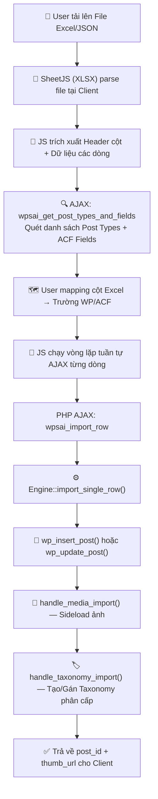
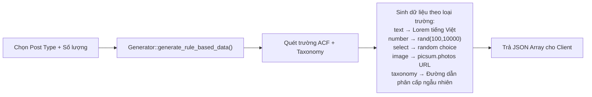
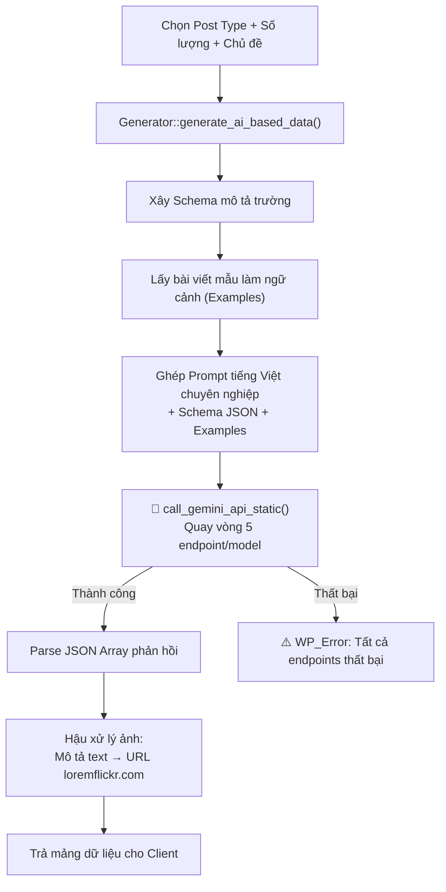
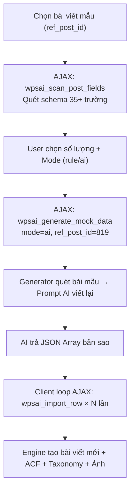
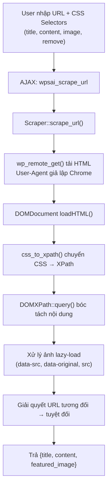
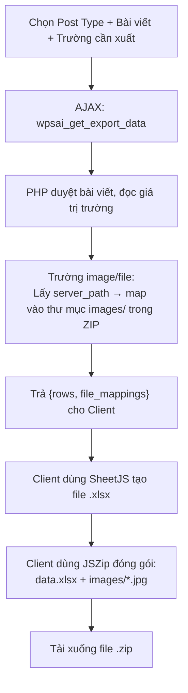
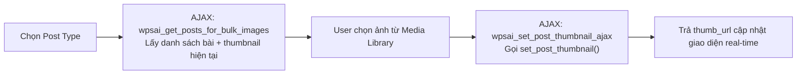
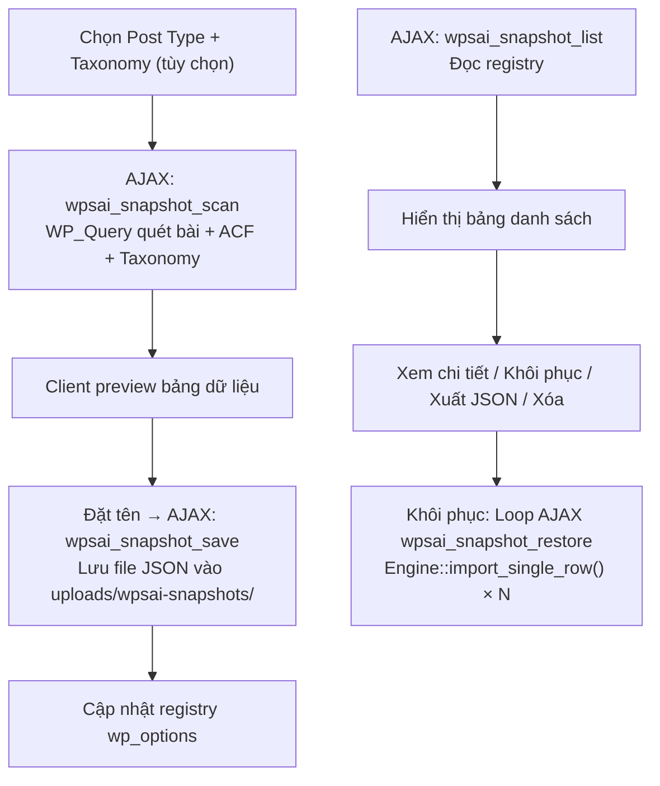
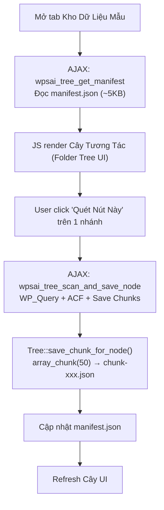
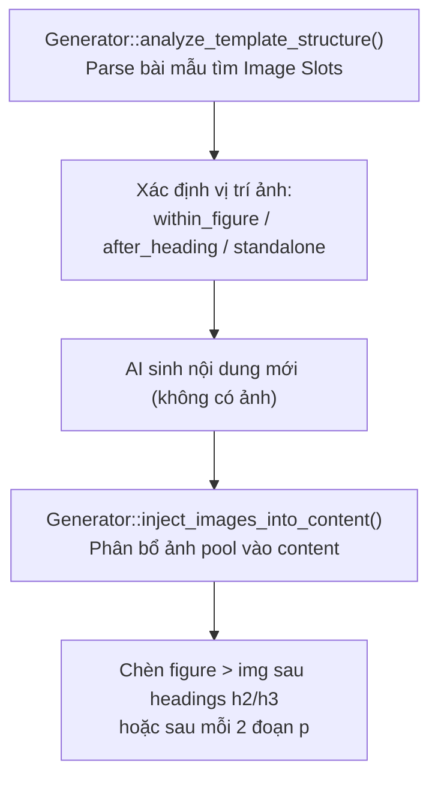

# SƠ ĐỒ LUỒNG XỬ LÝ CHI TIẾT (LUONG_XU_LY.md)

Tài liệu mô tả chi tiết **từng luồng xử lý (Data Flow)** trong plugin, bao gồm đầu vào, các bước xử lý, phương pháp sử dụng, và đầu ra.

---

## 🔄 LUỒNG 1: NHẬP LIỆU TỪ EXCEL/JSON (CORE IMPORT FLOW)

### Mục đích
Cho phép người dùng tải lên file Excel (.xlsx/.xls/.csv) hoặc JSON, mapping cột vào trường WordPress/ACF, rồi nhập hàng loạt bài viết.

### Sơ đồ luồng



### Chi tiết từng bước

| # | Bước | Xử lý bởi | Phương pháp |
|---|---|---|---|
| 1 | Parse file Excel tại Client | `admin-script.js` | Thư viện **SheetJS (XLSX v0.18.5)** parse trực tiếp trên trình duyệt, không cần gửi file lên server. Giảm tải I/O. |
| 2 | Quét cấu trúc trường | `Ajax::get_post_types_and_fields()` | Gọi `get_post_types('public')` + `Generator::get_acf_fields_for_post_type()` để lấy toàn bộ trường ACF của Post Type. |
| 3 | Mapping cột | `admin-script.js` | User kéo thả hoặc chọn dropdown mapping cột Excel sang trường đích (post_title, acf_xxx, tax_category...). |
| 4 | Import từng dòng | `Engine::import_single_row()` | Phân tích tiền tố key: `acf_*` → `update_field()`, `tax_*` → `handle_taxonomy_import()`, `meta_*` → `update_post_meta()`. |
| 5 | Sideload ảnh | `Engine::handle_media_import()` | Dùng `download_url()` + `media_handle_sideload()` tải ảnh từ URL ngoài vào Media Library. Nếu giá trị là ID số nguyên, trả về luôn. |
| 6 | Tạo Taxonomy phân cấp | `Engine::handle_taxonomy_import()` | Tách chuỗi `"Bất động sản > Chung cư"` bằng dấu `>`, duyệt đệ quy tạo term cha → con. Nếu term đã tồn tại thì lấy ID, chưa có thì `wp_insert_term()`. |

### Xử lý lỗi & Fallback
- Nếu ACF bị vô hiệu hóa → `get_acf_field_value()` tự fallback sang `get_post_meta()`.
- Nếu trường ACF Image nhận URL → Sideload thành attachment ID rồi mới `update_field()`.
- Nếu `post_title` trống → Tự sinh tiêu đề `"Bài viết tự động - {timestamp}"`.
- Nếu `post_id` có trong mapping + bài viết tồn tại → `wp_update_post()` thay vì `wp_insert_post()`.

---

## 🤖 LUỒNG 2: SINH DỮ LIỆU TỰ ĐỘNG (MOCK DATA GENERATION)

### Mục đích
Sinh nhanh bài viết mẫu để kiểm thử giao diện, không cần nhập liệu thủ công.

### 2 chế độ sinh

#### Chế độ A: Rule-Based (Quy tắc — Không cần API)



**Bảng quy tắc sinh theo loại trường:**

| Loại trường ACF | Phương pháp sinh |
|---|---|
| `text`, `textarea` | Lấy giá trị từ bài viết tham chiếu (nếu có) + thêm hậu tố `(Mẫu #i)` |
| `number` | `rand(min, max)` từ giá trị thực có sẵn, hoặc `rand(100, 10000)` |
| `select`, `radio` | `array_rand()` từ danh sách `choices` cấu hình trong ACF |
| `checkbox` | Chọn ngẫu nhiên 2 phần tử từ `choices`, nối bằng dấu phẩy |
| `true_false` | `rand(0, 1)` |
| `image`, `file` | `https://picsum.photos/800/600?random={i}` |
| `date_picker` | `date('Ymd', strtotime("+$i days"))` |
| `email` | `user_{i}@example.com` |
| `url` | `https://example.com/item-{i}` |
| `taxonomy` | Lấy term thật từ DB, nếu phân cấp trả `"Cha > Con"`, phẳng trả `"tag1, tag2"` |

#### Chế độ B: Gemini AI (Cần API Key)



**Chi tiết kỹ thuật Prompt Engineering:**

| Yếu tố | Chi tiết |
|---|---|
| Ngôn ngữ Prompt | Tiếng Việt chuyên nghiệp |
| Schema truyền vào | JSON Object mô tả ý nghĩa từng trường + ràng buộc (choices, format) |
| Bài mẫu tham chiếu | Tối đa 2 bài viết thật được serialize thành JSON Example |
| Tiêu đề tùy chỉnh | Nếu user cung cấp `custom_titles[]`, prompt bắt buộc AI giữ nguyên 100% |
| Layout template | Nếu user cung cấp bố cục, prompt yêu cầu AI viết theo đúng đề mục |
| Output format | `responseMimeType: application/json` (v1beta), hoặc parse raw JSON |
| Xử lý lỗi JSON | Strip markdown code fence `\`\`\`json ... \`\`\`` nếu AI trả về wrapped |
| Xử lý ảnh AI | Nếu giá trị không phải URL → coi là mô tả tiếng Anh → sinh URL `loremflickr.com/{keyword}` |

**Cơ chế quay vòng Model (Failover):**

```text
Thứ tự thử (lần lượt, dừng khi thành công):
1. gemini-2.5-flash (v1beta)    ← Ưu tiên cao nhất
2. gemini-2.0-flash (v1beta)
3. gemini-2.5-pro (v1beta)
4. gemini-flash-latest (v1beta)
5. gemini-2.5-flash (v1)        ← Fallback cuối cùng
```

---

## 🔁 LUỒNG 3: NHÂN BẢN BÀI VIẾT HÀNG LOẠT (BULK DUPLICATE)

### Mục đích
Chọn 1 bài viết chuẩn → AI viết lại nội dung cho N bản sao mới.



**Đặc điểm**:
- Prompt yêu cầu AI viết lại hoàn toàn, **không trùng lặp câu chữ** với bài mẫu và giữa các bản sao.
- Schema truyền vào chứa cả trường ACF (select/checkbox) với ràng buộc `choices` để AI chọn đúng.
- Taxonomy được sinh dạng đường dẫn phân cấp `"Cha > Con"` để Engine tự tạo cây term.

---

## 🌐 LUỒNG 4: CÀO DỮ LIỆU WEB (WEB SCRAPING)

### Mục đích
Nhập URL trang web → Plugin tự động bóc tách Title, Content, Image.



**Chi tiết phương pháp:**

| Phương pháp | Giải thích |
|---|---|
| `css_to_xpath()` | Chuyển CSS selector đơn giản (`.class`, `#id`, `tag.class`) sang XPath. Nếu bắt đầu `/` hoặc `(` → coi là XPath thô. |
| Selector `remove` | Loại bỏ quảng cáo, widget bằng cách xóa node DOM con trước khi lấy `innerHTML`. |
| Ảnh Lazy-load | Ưu tiên `data-src` → `data-original` → `src`. |
| URL tương đối | Tự ghép scheme + host từ URL gốc để tạo đường dẫn tuyệt đối. |
| User-Agent | Giả lập Chrome 120 để tránh bị chặn. |
| SSL | `sslverify => false` cho môi trường localhost. |

---

## 📤 LUỒNG 5: XUẤT DỮ LIỆU (EXPORT EXCEL + ZIP)

### Mục đích
Trích xuất bài viết + ảnh đính kèm thành file Excel và gói ZIP.



**Xử lý ảnh khi xuất:**
- Trường `featured_image`: Lấy `get_attached_file()` → đường dẫn server → copy vào ZIP dưới `images/{post_id}_featured_{filename}`.
- Trường ACF Image: Gọi `get_attachment_id_from_acf()` → thử raw value (ID), formatted value (array), URL → `attachment_url_to_postid()`.
- Nếu file server không tồn tại → Fallback ghi URL vào Excel.

---

## 🖼️ LUỒNG 6: GÁN ẢNH ĐẠI DIỆN HÀNG LOẠT (BULK IMAGE ASSIGN)



---

## 🔌 LUỒNG 7: KẾT NỐI CHROME EXTENSION (REST API BRIDGE)

### Mục đích
Cho phép Chrome Extension cào bài viết từ website ngoài → đẩy trực tiếp vào WordPress.

### REST API Endpoints

| Endpoint | Method | Chức năng |
|---|---|---|
| `/wp-json/wpsai/v1/connect` | GET | Kiểm tra kết nối, trả về `site_name` |
| `/wp-json/wpsai/v1/post-types` | GET | Trả danh sách Post Types + Taxonomies |
| `/wp-json/wpsai/v1/import` | POST | Nhập bài viết (title, content, image, post_type, taxonomy, terms + custom fields) |

### Xác thực
- Header: `X-WPSAI-API-KEY` hoặc query param `api_key`.
- Key lưu trong `wp_options` key `wpsai_extension_api_key`.
- Nếu chưa có key → Tự sinh bằng `wp_generate_password(24, false)`.

### CORS
- `Access-Control-Allow-Origin: *`
- `Access-Control-Allow-Headers: X-WPSAI-API-KEY, Content-Type, Authorization`
- Custom fields gửi kèm từ Extension tự động map sang `acf_*`.

---

## 📦 LUỒNG 8: KHO DỮ LIỆU MẪU — SNAPSHOT

### Mục đích
Quét toàn bộ dữ liệu bài viết → Lưu thành file JSON → Khôi phục/Tái sử dụng sau.



### Chế độ khôi phục
- **create_new**: Tạo bài viết mới hoàn toàn.
- **update_existing**: Ghi đè bài cũ theo `post_id` trong snapshot.

---

## 🌳 LUỒNG 9: KHO DỮ LIỆU — CÂY PHÂN CẤP (TREE REPOSITORY)

### Mục đích
Tổ chức kho mẫu theo cấu trúc cây phân cấp (Post Type > Taxonomy > Term) với phân mảnh file chunk (tối đa 50 bài/file).



### Cấu trúc thư mục trên server

```text
wp-content/uploads/wpsai-tree-repository/
├── manifest.json                              # Chỉ mục cây siêu nhẹ
├── product/
│   ├── chunk-node-pt-product-1.json          # 50 bài
│   └── chunk-node-pt-product-2.json          # 50 bài
├── post/
│   └── chunk-node-post-category-5-1.json     # Bài viết thuộc category ID=5
└── .htaccess                                  # Deny from all
```

---

## 🖼️ LUỒNG 10: CHÈN ẢNH TỰ ĐỘNG VÀO NỘI DUNG (IMAGE INJECTION)

### Mục đích
Khi nhân bản bài viết với AI, tự động chèn ảnh từ "Kho Ảnh" (Image Pool) vào vị trí phù hợp trong nội dung HTML.



### 3 chế độ phân bổ ảnh (Mode)

| Mode | Hành vi |
|---|---|
| `sequential` | Ảnh 1 cho vị trí 1, ảnh 2 cho vị trí 2... lặp vòng nếu hết pool |
| `random` | Chọn ngẫu nhiên từ pool cho mỗi vị trí |
| `cycle` | Giống sequential, lặp vòng (`pool[i % pool.length]`) |

### Ưu tiên vị trí chèn
1. **Bài mẫu có Image Slots** → Chèn ảnh sau heading tương tự.
2. **Không có slots** → Tìm h2/h3 trong content AI → Chèn sau heading.
3. **Không có heading** → Chèn sau mỗi 2 đoạn `</p>`.
4. **Fallback cuối** → Append cuối nội dung.
