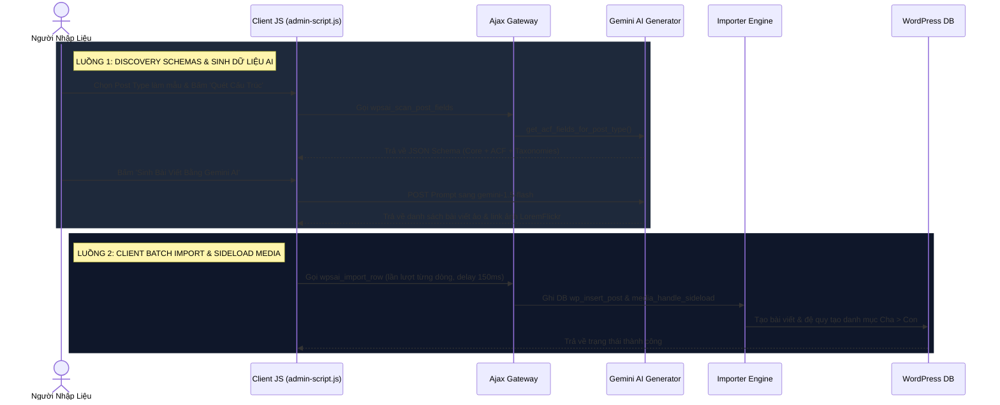

# 🔄 Quy Trình & Luồng Nghiệp Vụ (Workflows) — ACF Smart Importer

```mermaid
sequenceDiagram
    actor Admin as Người Nhập Liệu
    participant JS as Client JS (admin-script.js)
    participant AJAX as Ajax Gateway
    participant Gen as Gemini AI Generator
    participant Eng as Importer Engine
    participant WP as WordPress DB

    rect rgb(30, 41, 59)
    note right of Admin: LUỒNG 1: DISCOVERY SCHEMAS & SINH DỮ LIỆU AI
    Admin->>JS: Chọn Post Type làm mẫu & Bấm 'Quét Cấu Trúc'
    JS->>AJAX: Gọi wpsai_scan_post_fields
    AJAX->>Gen: get_acf_fields_for_post_type()
    Gen-->>JS: Trả về JSON Schema (Core + ACF + Taxonomies)
    Admin->>JS: Bấm 'Sinh Bài Viết Bằng Gemini AI'
    JS->>Gen: POST Prompt sang gemini-1.5-flash
    Gen-->>JS: Trả về danh sách bài viết ảo & link ảnh LoremFlickr
    end

    rect rgb(15, 23, 42)
    note right of Admin: LUỒNG 2: CLIENT BATCH IMPORT & SIDELOAD MEDIA
    JS->>AJAX: Gọi wpsai_import_row (lần lượt từng dòng, delay 150ms)
    AJAX->>Eng: Ghi DB wp_insert_post & media_handle_sideload
    Eng->>WP: Tạo bài viết & đệ quy tạo danh mục Cha > Con
    WP-->>JS: Trả về trạng thái thành công
    end
```
