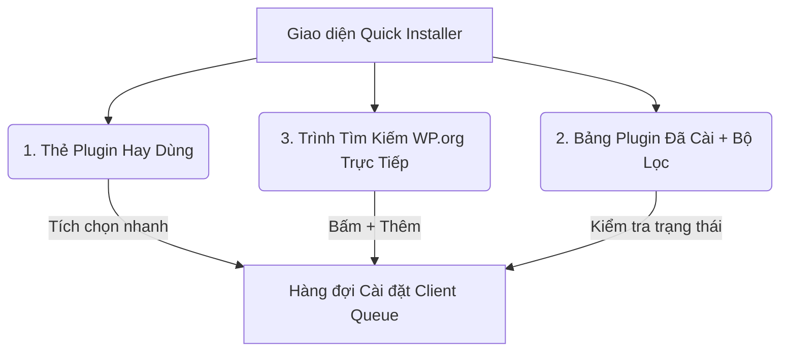
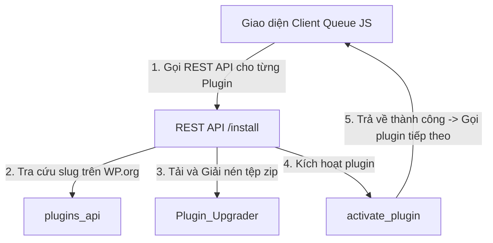

# 🔄 Quy Trình & Luồng Nghiệp Vụ (Workflows) — Quick Stack Installer

## 1. 3 Phân Vùng Nghiệp Vụ Trong Giao Diện

```mermaid
graph TD
    A[Giao diện Quick Installer] --> B(1. Thẻ Plugin Hay Dùng)
    A --> C(2. Bảng Plugin Đã Cài + Bộ Lọc)
    A --> D(3. Trình Tìm Kiếm WP.org Trực Tiếp)
    
    B -->|Tích chọn nhanh| E[Hàng đợi Cài đặt Client Queue]
    D -->|Bấm + Thêm| E
    C -->|Kiểm tra trạng thái| E
```

---

## 2. Luồng Hàng Đợi Bất Đồng Bộ (Async Client Queue)

```mermaid
graph TD
    A[Giao diện Client Queue JS] -->|1. Gọi REST API cho từng Plugin| B[REST API /install]
    B -->|2. Tra cứu slug trên WP.org| C[plugins_api]
    B -->|3. Tải và Giải nén tệp zip| D[Plugin_Upgrader]
    B -->|4. Kích hoạt plugin| E[activate_plugin]
    E -->|5. Trả về thành công -> Gọi plugin tiếp theo| A
```
