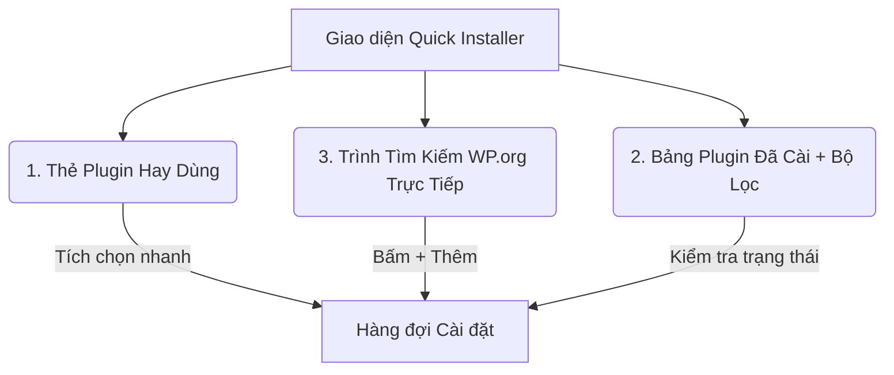
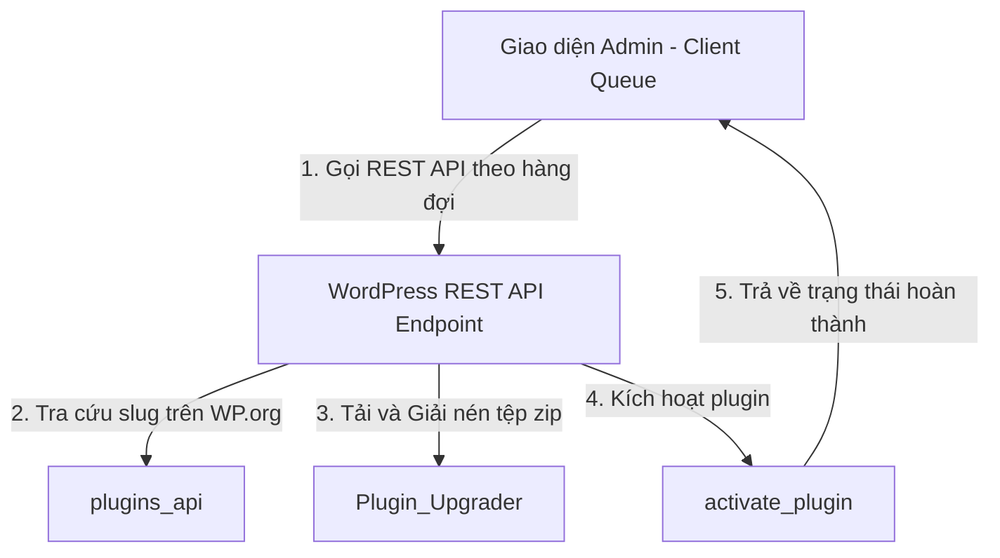

# Ý Tưởng Thiết Kế: Plugin Tự Động Cài Đặt Stack WordPress (WDM Quick Stack Installer)

Tài liệu này phác thảo ý tưởng thiết kế, kiến trúc kỹ thuật và luồng xử lý chi tiết cho một plugin mới chuyên biệt: **Tự động cài đặt hàng loạt plugin từ thư viện WordPress.org** theo danh sách đã chọn trước (Quick Install Stacks).

---

## 💡 Triết Lý Thiết Kế & Lợi Ích Cốt Lõi

Khi setup một website WordPress mới cho khách hàng, lập trình viên thường mất từ 15-30 phút chỉ để tìm kiếm, cài đặt và kích hoạt các plugin quen thuộc như *Classic Editor, Advanced Custom Fields, Elementor, Rank Math SEO, Wordfence, v.v.*

Plugin này ra đời để giải quyết bài toán đó: **Thiết lập website trong 1 click chuột**.
- **Tiết kiệm thời gian**: Cài đặt và kích hoạt song song/tuần tự cả một "Stack" (bộ công cụ) chỉ trong vòng 1-2 phút.
- **Đóng gói chuyên nghiệp**: Cho phép tạo các bộ combo định sẵn (ví dụ: *Combo Bán hàng, Combo Tin tức, Combo SEO & Bảo mật*).
- **Mượt mà & Trực quan**: Giao diện Modern Glassmorphism đồng bộ với WDM Portal, có thanh tiến trình hiển thị trạng thái thực của từng plugin (Đang tải -> Cài đặt -> Kích hoạt -> Hoàn tất).

---

## 🔄 3 Luồng Nghiệp Vụ Mới Bổ Sung (New Workflows)

Để tối ưu hóa quy trình làm việc thực tế, hệ thống tích hợp 3 luồng chức năng đột phá sau:



### 1. Luồng 1: Danh sách Plugin Hay Dùng (Favorites / Frequently Installed)
* **Mô tả**: Một phân vùng riêng hiển thị danh sách các plugin "quốc dân" thường xuyên được sử dụng qua các dự án (ví dụ: *Classic Editor, Contact Form 7, Elementor, ACF, Rank Math*).
* **Hoạt động**: 
  - Bên cạnh mỗi tên plugin có hộp tích chọn (Checkbox) nhanh.
  - Người dùng chỉ cần tích chọn các plugin muốn cài đặt cho dự án hiện tại, chọn nút `Thêm vào hàng đợi cài đặt`.
  - Hệ thống sẽ tự động quét trạng thái và đưa các plugin này vào danh sách chuẩn bị tải.

### 2. Luồng 2: Bảng Plugin Đã Cài & Bộ Lọc Tình Trạng (Installed Plugins & Live Filter)
* **Mô tả**: Bảng hiển thị toàn bộ các plugin hiện có trên website (cả đang hoạt động, đang tắt, hoặc chưa có).
* **Chức năng**:
  - **Live Search Filter**: Ô tìm kiếm nhanh cho phép lọc danh sách plugin theo tên hoặc tác giả ngay lập tức.
  - **Đồng bộ hàng đợi**: Bảng sẽ tự động đánh dấu các plugin nào trong danh sách Stack *đã được cài đặt* trên hệ thống để tránh tải trùng lặp, đồng thời hiển thị nút `Kích hoạt nhanh` nếu plugin đó đã nằm trên host nhưng chưa kích hoạt.

### 3. Luồng 3: Tìm Kiếm Trực Tiếp Từ Thư Viện WP.org (Integrated WP.org Live Search)
* **Mô tả**: Một khu vực tìm kiếm plugin thông minh ngay trong giao diện điều khiển, không yêu cầu người dùng phải chuyển hướng sang trang "Plugins -> Add New" truyền thống của WordPress.
* **Hoạt động**:
  - Người dùng gõ tên plugin bất kỳ (ví dụ: `wp-rocket`, `woocommerce`).
  - Hệ thống sử dụng AJAX kết nối trực tiếp với WordPress.org REST API để trả về danh sách kết quả ngay lập tức (hiển thị đầy đủ: tên plugin, tác giả, đánh giá sao, mô tả ngắn).
  - Có nút `+ Thêm vào Stack` bên cạnh mỗi kết quả tìm kiếm để nhanh chóng đẩy vào danh sách chờ cài đặt.

---

## 🛠️ Kiến Trúc Hệ Thống (System Architecture)

Hệ thống sẽ được chia thành 2 phần cốt lõi:



### 1. Backend: WordPress API Core (`includes/`)
WordPress sở hữu các hàm lõi (core functions) cực mạnh phục vụ cài đặt mà ít người khai thác trực tiếp:
- **`plugins_api()`**: Nằm trong `wp-admin/includes/plugin-install.php`. Giúp lấy thông tin chi tiết và link tải file `.zip` chính thức từ WordPress.org thông qua slug (ví dụ: `classic-editor`).
- **`Plugin_Upgrader`**: Lớp tiện ích trong `wp-admin/includes/class-wp-upgrader.php` đảm nhiệm tải xuống, giải nén và di chuyển thư mục plugin vào `wp-content/plugins/`.
- **`activate_plugin()`**: Kích hoạt plugin để sẵn sàng sử dụng.

### 2. Frontend: Hàng Đợi Bất Đồng Bộ (Asynchronous Installation Queue)
> [!WARNING]
> Nếu cài đặt cùng lúc 10-15 plugin trong một chu kỳ PHP duy nhất, máy chủ chắc chắn sẽ bị quá tải hoặc gặp lỗi **Maximum Execution Time Timeout (30s)**.

**Giải pháp**: Sử dụng **Client-side Queue (Hàng đợi phía máy khách)** thông qua JavaScript.
- JavaScript gửi request cài đặt từng plugin một (ví dụ: cài xong *Classic Editor* mới gửi tiếp request cài *Elementor*).
- Trải nghiệm người dùng cực tốt: Tránh nghẽn server và cập nhật tiến trình cài đặt vô cùng chi tiết.

---

## 🗂结构 Đề Xuất Cấu Trúc File Dự Án (New Plugin Structure)

Dự án plugin mới mang tên: `wdm-quick-installer`

```text
wdm-quick-installer/
├── wdm-quick-installer.php             # File kích hoạt plugin chính
├── includes/
│   ├── class-wdm-qi-api.php            # Đăng ký REST API Endpoint (/install, /search-wp, /installed)
│   ├── class-wdm-qi-installer.php      # Xử lý Logic cài đặt lõi (Plugin_Upgrader)
│   └── class-wdm-qi-db.php             # Quản lý cấu hình & lưu các Stack tùy chỉnh
├── assets/
│   ├── css/
│   │   └── admin-style.css             # Giao diện Glassmorphism cao cấp
│   └── js/
│       └── installer-queue.js          # Xử lý hàng đợi Queue & AJAX Tìm kiếm/Bộ lọc
└── templates/
    └── main-page.php                   # Giao diện trang điều khiển chính (Bố cục 3 Phân vùng)
```

---

## 🎨 Giao Diện Bố Cục Đề Xuất (Layout UX/UI)

Giao diện sẽ được thiết kế theo cấu trúc **Grid 3 Cột (3-Column Grid Layout)** tương đồng với phong cách WDM Portal:

### 1. Cột 1: Kho Plugin Hay Dùng & Tìm Kiếm Trực Tiếp (Sidebar Trái)
* **Khu vực 1: Bộ lọc Plugin Hay Dùng**:
  - Danh sách checkbox các plugin quốc dân dạng pill gọn gàng.
  - Tích chọn nhanh và nhấn nút `+ Đưa vào hàng đợi`.
* **Khu vực 2: Hộp Tìm Kiếm WP.org**:
  - Một ô input tìm kiếm đẹp mắt. Gõ từ khóa sẽ hiện kết quả dạng popup mini phía dưới với nút `Thêm nhanh` rất hiện đại.

### 2. Cột 2: Danh Sách Chờ & Thanh Tiến Trình Cài Đặt (Khối Trung Tâm)
* **Khu vực 3: Hàng đợi cài đặt (Queue Console)**:
  - Danh sách các plugin được chọn để chuẩn bị cài.
  - Nút bấm lớn `🚀 Bắt Đầu Cài Đặt Hàng Loạt`.
  - Thanh tiến trình dynamic:
    - 🔄 **Classic Editor**: *Đang tải tệp tin zip... (45%)* (Thanh Progress bar phát sáng màu Neon Amber).
    - ⏳ **Elementor**: *Đang chờ trong hàng đợi...*
    - 🛡️ **Wordfence Security**: *Đang kích hoạt...* (Màu Neon Emerald).

### 3. Cột 3: Bảng Quản Lý Các Plugin Đã Cài (Bên Phải)
* **Khu vực 4: Bảng Plugin Hiện Tại**:
  - Ô tìm kiếm bộ lọc (Filter input) ở trên đầu bảng.
  - Danh sách bảng gồm: Tên plugin | Trạng thái (Đang bật - xanh lục / Đang tắt - xám / Chưa cài - đỏ) | Nút hành động nhanh (Bật/Tắt).
  - Tự động highlight nếu plugin trong bảng trùng khớp với các plugin đang nằm trong Stack chờ cài đặt để người dùng nắm bắt thông tin tức thời.
