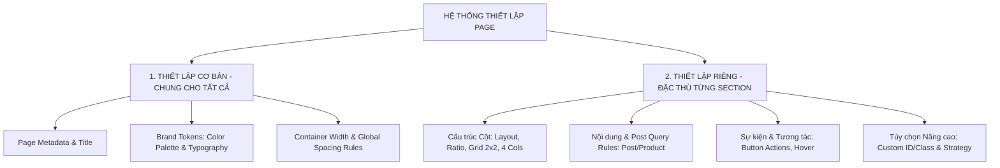

# BỘ THIẾT LẬP CẤP ĐỘ HỆ THỐNG: THIẾT LẬP CƠ BẢN & THIẾT LẬP RIÊNG (ELEMENTOR JSON)

> **Mục tiêu**: Phân loại hệ thống thiết lập thành **2 Cấp Độ Rõ Ràng**: **1. THIẾT LẬP CƠ BẢN (Giao diện & Quy tắc chung)** và **2. THIẾT LẬP RIÊNG (Đặc thù từng Section)**. Giúp việc cấu hình và sinh file JSON cho Elementor Pro cực kỳ ngắn gọn, nhất quán và không bao giờ bị xung đột style.

---

## ⚙️ HỆ THỐNG PHÂN LOẠI 2 CẤP THIẾT LẬP (SETTINGS HIERARCHY)

---

## 🌐 1. THIẾT LẬP CƠ BẢN (GLOBAL / BASIC SETTINGS)
*Đây là nhóm thiết lập dùng chung, được kế thừa và áp dụng cho TOÀN BỘ các Section trên trang:*

| Thành Phần | Giá Trị Chuẩn / Mặc Định | Mục Đích Sử Dụng |
| :--- | :--- | :--- |
| **Page Info** | Title: `"Trang Chủ GOONGBE VN"`, Type: `"page"` | Khởi tạo thông tin trang trong bảng `wp_posts`. |
| **Màu Chủ Đạo (Primary)** | `#1B5B65` *(Teal đậm)* | Dùng cho Tiêu đề chính H1/H2, Button chính và Footer CTA. |
| **Màu Điểm Nhấn (Accent)** | `#4CB9CC` *(Xanh ngọc)* | Dùng cho Tagline Subtitle, Divider, Icon và Button phụ. |
| **Màu Chữ Body (Text)** | `#333333` / `#666666` | Dùng cho đoạn văn bản mô tả chính. |
| **Font Chữ (Typography)** | `Plus Jakarta Sans` / `Inter` | Font chữ chuẩn toàn website. |
| **Container Width** | `1200px` | Chiều rộng tối đa chuẩn của khung giao diện. |
| **Vertical Spacing** | Top/Bottom `60px - 80px` | Khoảng cách căn lề chuẩn giữa các Section. |

---

## 🧩 2. THIẾT LẬP RIÊNG (SECTION-SPECIFIC / CUSTOM SETTINGS)
*Đây là nhóm thiết lập đặc thù, ghi đè (Override) và cấu hình riêng biệt cho TỪNG Section:*

### 🔹 1. Bố Cục Cột (Custom Layout & Grid)
- Cấu trúc cột riêng: 1 cột (100%), 2 cột (50-50%), **Grid 2 Hàng x 2 Cột (4 Banner)**, 3 cột, 4 cột, 6 cột partner.
- Tỷ lệ căn chỉnh dọc (Vertical Align: `Middle`, `Top`, `Bottom`).

### 🔹 SECTION 5: SẢN PHẨM MỚI & BỘ KHĂN ƯỚT EM BÉ (PRODUCT CAROUSEL SLIDER) [MỚI BỔ SUNG]
- 📐 **LAYOUT**: Full Width (Tràn viền 100vw toàn màn hình), Alignment: `Center`.
- 📝 **CONTENT**:
  - H2 Title: `"SẢN PHẨM MỚI & BỘ KHĂN ƯỚT DỊU NHẸ GOONGBE"` (Color Primary `#1B5B65`, Size 30px, Weight 800).
  - **Widget Carousel 4 Slides (Engine: Media Carousel Widget)**:
    - `slides_per_view`: 4 (Hiển thị đồng thời 4 Slide trên Desktop).
    - `slides_to_scroll`: 1 (Trượt 1 Slide mỗi lần).
    - `equal_height`: "yes" (Chiều cao các ảnh sản phẩm bằng nhau 100%, 320px / 1:1).
    - **4 Slide Items**:
      1. Slide 1: Phấn Phủ Dịu Nhẹ Em Bé GOONGBE 25g (Tag `New` Teal `#009AA5` + German Dermatest Seal).
      2. Slide 2: Sữa Tắm Vệ Sinh Em Bé Baby Hip Cleanser 300ml (Tag `New` Teal + German Dermatest Seal).
      3. Slide 3: Khăn Ướt Em Bé An Toàn GOONGBE 70 Tờ (Tag `New` Teal + German Dermatest Seal).
      4. Slide 4: Khăn Ướt Dịu Nhẹ Gia Đình GOONGBE 100 Tờ (German Dermatest Seal).
- ⚡ **EVENT**:
  - Slide Navigation: Nút mũi tên tròn màu xanh ngọc bên phải (`>`), Autoplay `4000ms`, Pause on Hover.
  - Slide Item Hover: Elevate Shadow nhẹ, Zoom ảnh 1.04x.
- ⚙️ **OPTION**:
  - Background Color: `#FAF9F6`.
  - Strategy: `CUSTOM_SCRATCH (CAROUSEL SLIDER)`.

### 🔹 2. Nội Dung & Dữ Liệu Riêng (Specific Content & Query Rules)
- Chuỗi văn bản Tiêu đề, Đoạn văn, Nhãn Badge (`NEW`, `HOT`, `BEST`, `NONE`).
- Đường dẫn file Media (Image URLs, Aspect Ratios).
- Quy tắc Query bài viết/sản phẩm: Post Type (`post` / `product`), Số lượng hiển thị (`3` / `4`), Thứ tự (`date DESC`).

### 🔹 3. Sự Kiện & Tương Tác Riêng (Custom Events & Actions)
- Hành động khi Click Button: Cuộn mượt đến anchor (`#bestseller`), Mở tab Youtube mới (`target="_blank"`), Thêm vào giỏ hàng AJAX (`add_to_cart`).
- Hiệu ứng Hover: Phóng to ảnh (Zoom `1.05x`), Nâng bóng Card (Elevate Shadow `-6px`).

### 🔹 4. Tùy Chọn Nâng Cao & Hướng Dựng (Advanced Options & Strategy)
- Định danh riêng: Custom Anchor ID (VD: `id="bestseller"`), Custom CSS Class (`class="goongbe-hero"`).
- Màu nền riêng từng khối (Background Hex: `#E8F6F9`, `#D8F1F5`, `#E5F6F8`, `#F4FAFC`, `#FAF9F6`).
- Chiến lược xây dựng: `UI_LIBRARY` (Tái sử dụng mẫu có sẵn) vs `CUSTOM_SCRATCH` (Tạo mới).
