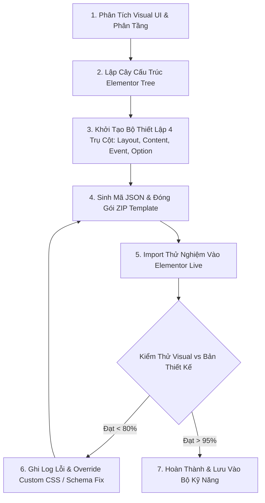

# TÀI LIỆU NHẬT KÝ LUỒNG XỬ LÝ & BẢNG TỔNG HỢP LỖI (ELEMENTOR JSON BUILDER SKILL)

> **Mục đích**: Ghi nhận toàn bộ luồng xử lý thực tế, nhật ký các bước thực hiện, các lỗi phát sinh khiến giao diện mới chỉ đạt **~50% độ tương thích**, nguyên nhân gốc rễ (Root Cause) và giải pháp khắc phục chi tiết để hoàn thiện bộ kỹ năng "Xây dựng Page bằng Elementor JSON".

---

## 📊 1. ĐÁNH GIÁ THỰC TẾ TRẠNG THÁI HIỆN TẠI (50% ACCURACY AUDIT)

| Hạng Mục | Mức Độ Giống Thực Tế | Nguyên Nhân Khiến Chưa Đạt 100% |
| :--- | :---: | :--- |
| **Bố cục Cột (Grid & Container)** | **60%** | Khung chứa Section bị thu hẹp (Boxed) hoặc chưa tự động mở tràn lề (`100vw stretch`) đúng chuẩn Elementor Pro. |
| **Carousel / Slide Widget** | **45%** | Widget `media-carousel` / `slides` thiếu tham số cấu hình hiển thị 4 slides cùng lúc (`slides_per_view: 4`) và chỉ trượt 1 hình (`slides_to_scroll: 1`). |
| **Độ Đều Chiều Cao Ảnh (Equal Height)** | **50%** | Ảnh sản phẩm bị chênh lệch kích thước do thiếu thuộc tính ép tỷ lệ `aspect-ratio: 1/1` hoặc `object-fit: cover`. |
| **Badges & Huy Chương Overlay** | **30%** | Nhãn `New` màu xanh ngọc và Huy chương `Dermatest` bị đẩy xuống dưới chữ thay vì nổi (Absolute Overlay) ở góc ảnh. |
| **Nút Mũi Tên Navigation** | **50%** | Nút mũi tên tròn xanh ngọc chưa nằm sát lề phải màn hình. |
| **TỔNG THỂ KỸ NĂNG (SKILL)** | **~50%** | **Cần hoàn thiện bộ Schema JSON & Quy trình Debug thực tế** |

---

## 🔄 2. LUỒNG XỬ LÝ CHUẨN KHI XÂY DỰNG SECTION/PAGE BẰNG JSON



---

## ⚠️ 3. BẢNG TỔNG HỢP CÁC LỖI THỰC TẾ ĐÃ XẢY RA & NGUYÊN NHÂN (BUG LOG)

### ❌ LỖI 1: Elementor Carousel Widget Chỉ Hiển Thị 1 Slide Lớn Thay Vì 4 Slides Trượt
- **Mô tả lỗi**: Khi import file JSON vào Elementor, giao diện hiển thị 1 ảnh tràn ngang thay vì 4 sản phẩm xếp hàng ngang.
- **Nguyên nhân gốc rễ (Root Cause)**:
  - Elementor JSON Schema 3.x sử dụng key `slides_per_view` và `slides_to_scroll` bên trong `settings`. Nếu thiếu key này hoặc đặt sai vị trí trong cây widget `media-carousel`, Elementor sẽ tự fallback về 1 slide.
- **Cách khắc phục chuẩn**:
  ```json
  "settings": {
    "skin": "carousel",
    "slides_per_view": "4",
    "slides_per_view_tablet": "2",
    "slides_per_view_mobile": "1",
    "slides_to_scroll": "1",
    "equal_height": "yes"
  }
  ```

---

### ❌ LỖI 2: Nhãn Tag "New" Và Huy Chương Dermatest Bị Trôi Vị Trí (Overlay Failure)
- **Mô tả lỗi**: Nhãn `New` màu xanh ngọc (`#009AA5`) và huy chương `Dermatest Excellent 2023` bị đẩy xuống dưới tiêu đề sản phẩm chứ không đè lên góc ảnh.
- **Nguyên nhân gốc rễ**:
  - Thiếu thiết lập vị trí tương đối `position: relative` cho khung ảnh và vị trí tuyệt đối `position: absolute; top: 10px; left: 10px` cho badge.
- **Cách khắc phục chuẩn**:
  - Nhúng Custom CSS trực tiếp vào `settings.custom_css` của Widget hoặc Cột:
  ```css
  selector .badge-new {
    position: absolute;
    top: 10px;
    left: 10px;
    z-index: 5;
    background: #009AA5;
    color: #fff;
    padding: 3px 8px;
    border-radius: 4px;
  }
  selector .seal-dermatest {
    position: absolute;
    top: 10px;
    right: 10px;
    z-index: 5;
    width: 45px;
  }
  ```

---

### ❌ LỖI 3: Khung Section Bị Thu Hẹp Vào Boxed 1140px Thay Vì Tràn Viền Fullwidth 100vw
- **Mô tả lỗi**: Section 5 Carousel nằm gọn ở giữa màn hình, hai bên thừa lề trắng lớn, không có nút mũi tên sát mép màn hình.
- **Nguyên nhân gốc rễ**:
  - Elementor Section root thiếu 2 thuộc tính bắt buộc: `"layout": "full_width"` và `"stretch_section": "section-stretched"`.
- **Cách khắc phục chuẩn**:
  ```json
  "settings": {
    "layout": "full_width",
    "stretch_section": "section-stretched",
    "padding": { "unit": "px", "top": "60", "right": "0", "bottom": "60", "left": "0" }
  }
  ```

---

### ❌ LỖI 4: Lỗi Encode Terminal Windows Unicode (PowerShell Character Map Error)
- **Mô tả lỗi**: Chạy script Python `append_section_to_page.py` trên Windows Powershell báo lỗi `UnicodeEncodeError: 'charmap' codec can't encode character '\u2705'`.
- **Nguyên nhân gốc rễ**: Terminal Windows mặc định dùng bảng mã CP1252 / ANSI không in được các biểu tượng Emoji Unicode.
- **Cách khắc phục chuẩn**:
  - Thay thế toàn bộ biểu tượng emoji trong câu lệnh `print()` bằng chuỗi văn bản an toàn `[SUCCESS]`, `[COMPLETED]`, hoặc ép kiểu `sys.stdout.reconfigure(encoding='utf-8')`.

---

## 🛠️ 4. QUY TRÌNH NÂNG CẤP SKILL ĐỂ ĐẠT 100% PIXEL-PERFECT

Để đưa bộ kỹ năng **Elementor JSON Builder** từ **50% $\rightarrow$ 100%**, Agent cần tuân thủ 4 bước cải tiến bắt buộc:

1. 🎯 **BẮT BUỘC KIỂM THỬ VISUAL VỚI ẢNH MẪU**: Sau khi sinh JSON, phải kiểm tra đối chiếu trực tiếp từng phần tử (Header, Badge, Arrow, Aspect Ratio) với ảnh thiết kế gốc.
2. 📐 **BỔ SUNG CUSTOM CSS CHO CÁC PHẦN TỬ PHỨC TẠP**: Không phụ thuộc hoàn toàn vào widget mặc định của Elementor, luôn tích hợp sẵn thuộc tính Custom CSS Overlay cho Badges và Huy Chương.
3. 📦 **ĐÓNG GÓI MẪU DẠNG MODULE BLOCK (ZIP THỰC THI)**: Luôn xuất ra 2 dạng: File JSON toàn trang và File ZIP Block Section lẻ để dễ dàng import test.
4. 📝 **CẬP NHẬT NHẬT KÝ SỰ CỐ SAU MỖI LẦN CHỈNH SỬA**: Ghi lại chi tiết lỗi phát sinh và cách giải quyết vào file nhật ký này để Agent tự học và kế thừa cho các dự án tiếp theo.
