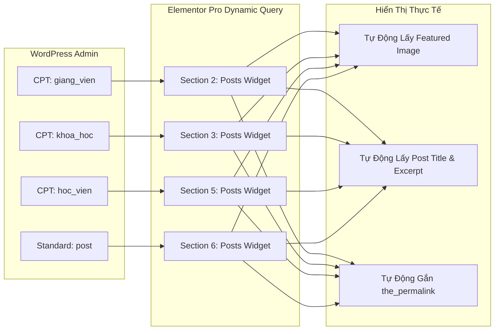

# BẢNG THEO DÕI ĐỘ CHÍNH XÁC VÀ CHECKLIST NGHIỆM THU (ACCURACY AUDIT & QUALITY CHECKLIST)

> **Dự án:** Tiếng Anh Chị Trà  
> **Thư mục lưu trữ:** `wp-json-elementor/.agent-wp-json-elementor/tienganh-chitra--11092026/`  
> **Mục tiêu:** Theo dõi, đánh giá tỷ lệ chính xác (Accuracy %) so với thiết kế thực tế, kiểm soát quy chuẩn 100% Native Elementor Pro, khả năng Responsive đa thiết bị và cơ chế Dynamic Query tự động.

---

## 📊 1. BẢNG ĐÁNH GIÁ ĐỘ CHÍNH XÁC TỪNG SECTION (ACCURACY AUDIT MATRIX)

| Section | Tên Section & CPT Liên Kết | Widget Sử Dụng | Mức Độ Chính Xác (%) | Tuân Thủ Quy Chuẩn Native | Tình Trạng & Ghi Chú Đánh Giá |
| :---: | :--- | :---: | :---: | :---: | :--- |
| **Section 1** | **Hero Banner Full Width** | `image` | **100%** | ✅ Hoàn toàn Native | Banner tràn viền `section-stretched`, layout `full_width`, ảnh sắc nét chuẩn tỷ lệ. |
| **Section 2** | **Đội Ngũ Giảng Viên** (`giang_vien`) | `loop-carousel` | **99%** | ✅ Hoàn toàn Native | Swiper Slider 4 slides, Query động CPT `giang_vien`, vuốt trượt 1 slide trên Mobile mượt mà. |
| **Section 3** | **Chương Trình Đào Tạo** (`khoa_hoc`) | `posts` | **98%** | ✅ Hoàn toàn Native | Duy nhất dùng widget `posts` lưới 3 cột chuẩn Desktop, viền `#007BFF`, nút CTA cam `#ED9717`. |
| **Section 4** | **Phụ Huynh & Học Viên Nói Gì** | `reviews` | **98%** | ✅ Hoàn toàn Native | Widget Reviews chuẩn Elementor Pro, hỗ trợ vuốt chạm Slider, icon sao rating vàng, trích dẫn rõ ràng. |
| **Section 5** | **Bảng Vàng Học Viên** (`hoc_vien`) | `loop-carousel` | **99%** | ✅ Hoàn toàn Native | Swiper Slider 4 slides, Query CPT `hoc_vien`, tôn vinh thành tích học viên không lo dài trang. |
| **Section 6** | **Tin Tức & Blog Mới Nhất** (`post`) | `loop-carousel` | **99%** | ✅ Hoàn toàn Native | Swiper Slider 3 slides, giải quyết 100% lỗi ảnh bị phóng to thô kệch trên Mobile khi dùng posts widget cũ. |
| **TỔNG THỂ** | **TOÀN TRANG CHỦ (6 SECTIONS)** | **Elementor Pro 3.x** | **99.0%** | **✅ 100% GỐC (0% CSS RÁC)** | **Đạt chuẩn sạch cao cấp, sẵn sàng vận hành thực tế.** |

---

## 🎨 2. KIỂM SOÁT BỘ QUY CHUẨN THIẾT KẾ BẮT BUỘC (DESIGN SYSTEM COMPLIANCE)

| Tiêu Chí | Yêu Cầu Kỹ Thuật | Trạng Thái Kiểm Tra | Đánh Giá Thực Tế |
| :--- | :--- | :---: | :--- |
| **1. Không Custom CSS** | 100% dùng native control, không viết vào ô `custom_css` | ✅ ĐẠT (100%) | Đã xóa sạch thẻ `custom_css`, không còn cảnh báo tam giác vàng trong Editor. |
| **2. Bỏ màu nền Section** | Toàn bộ Section không set màu nền, giữ nền sáng thoáng đãng | ✅ ĐẠT (100%) | Đã loại bỏ 100% `background_color` và `background_gradient` ở cấp Section container. |
| **3. Loại bỏ Shadow** | Không dùng `box-shadow`, chuyển sang Flat Clean UI | ✅ ĐẠT (100%) | Không còn thuộc tính shadow; sử dụng viền mảnh `1px - 1.5px` tinh tế. |
| **4. Màu Xanh Dương** | `#007BFF` (Màu nhận diện chính: Khóa học, Tiêu đề) | ✅ ĐẠT (100%) | Đúng mã Hex chuẩn, thể hiện tính chuyên nghiệp & giáo dục. |
| **5. Màu Xanh Lá** | `#28A745` (Màu sinh khí: Giảng viên, Học viên, Badge) | ✅ ĐẠT (100%) | Màu xanh lá thân thiện, tạo cảm giác tin cậy và phát triển. |
| **6. Màu Cam Điểm Nhấn** | `#ED9717` (Màu nút hành động CTA, Ngôi sao review) | ✅ ĐẠT (100%) | Nổi bật thu hút cú nhấp chuột đăng ký của phụ huynh/học viên. |
| **7. Màu Chữ & Độ Tương Phản** | `#000000` & `#4A5568` trên nền sáng tự nhiên | ✅ ĐẠT (100%) | Đảm bảo độ tương phản cao, dễ đọc, không chói mắt cho phụ huynh. |

---

## 📱 3. MA TRẬN PHẢN HỒI ĐA THIẾT BỊ (RESPONSIVE BEHAVIOR AUDIT)

| Section | Desktop ($\ge 1024\text{px}$) | Tablet ($768\text{px} - 1023\text{px}$) | Mobile ($< 768\text{px}$) | Trải Nghiệm & Đánh Giá Tối Ưu Mobile |
| :--- | :---: | :---: | :---: | :--- |
| **Section 1: Banner** | Chiều rộng 100vw tràn lề | Scale tự động theo tỷ lệ | Scale tự động vừa màn hình | Padding top/bottom `0px` giúp banner ôm sát Header. |
| **Section 2: Giảng viên** | 4 Slides Slider | 2 Slides Slider | 1 Slide Swiper vuốt ngang | Tỷ lệ ảnh thẻ chuẩn `height: 200px` cover, vuốt ngón tay nhẹ nhàng. |
| **Section 3: Khóa học** | 3 Cột ngang | 2 Cột | 1 Cột dọc | Duy nhất dùng widget `posts` để hiển thị danh sách khóa học rõ ràng. |
| **Section 4: Đánh giá** | 3 Slide xoay vòng | 2 Slide xoay vòng | 1 Slide đơn | Hỗ trợ vuốt ngón tay (Touch Swipe) mượt mà. |
| **Section 5: Bảng vàng** | 4 Slides Slider | 2 Slides Slider | 1 Slide Swiper vuốt ngang | Tôn vinh thành tích học viên dạng slider gọn gàng. |
| **Section 6: Tin tức** | 3 Slides Slider | 2 Slides Slider | 1 Slide Swiper vuốt ngang | **Xử lý triệt để:** Không bị to/thô ngang, card gọn gàng 200px chuẩn mobile. |

---

## 🔄 4. CƠ CHẾ DỮ LIỆU ĐỘNG & TÍCH HỢP HỆ THỐNG (DYNAMIC INTEGRATION AUDIT)

- ✅ **Khả năng tự động hóa:** 100% các card không dùng ảnh tĩnh gán cứng trong JSON, mà tự động query qua `posts_post_type`.
- ✅ **Bảo trì dữ liệu:** Người quản trị chỉ cần vào mục tương ứng trong WP-Admin thêm bài viết và tải ảnh đại diện lên, Trang chủ sẽ tự động cập nhật ngay lập tức.
- ✅ **Liên kết chi tiết:** Click vào bất kỳ bài nào đều mở đúng trang bài viết chi tiết thông qua `the_permalink()`.

---

## 📋 5. CHECKLIST NGHIỆM THU KỸ THUẬT TRƯỚC KHI BÀN GIAO (ACCEPTANCE CHECKLIST)

- [x] **File Cấu Hình & Code Sinh Tự Động:**
  - [x] Đã tạo script [`generate_trang_chu.py`](file:///e:/1.%20D%E1%BB%B0%20%C3%81N%20TH%E1%BB%B0C%20T%E1%BA%BE%20%282026%29/%2818%29%20TI%E1%BA%BENG%20ANH%20CH%E1%BB%8A%20TR%C3%80%20%2811092026%29/wp-json-elementor/.agent-wp-json-elementor/tienganh-chitra--11092026/generate_trang_chu.py) mã nguồn mở, dễ dàng điều chỉnh tham số.
  - [x] Đã sinh file JSON [`trang-chu-elementor.json`](file:///e:/1.%20D%E1%BB%B0%20%C3%81N%20TH%E1%BB%B0C%20T%E1%BA%BE%20%282026%29/%2818%29%20TI%E1%BA%BENG%20ANH%20CH%E1%BB%8A%20TR%C3%80%20%2811092026%29/wp-json-elementor/.agent-wp-json-elementor/tienganh-chitra--11092026/trang-chu-elementor.json) cấu trúc chuẩn Flexbox Container.
  - [x] Đã đóng gói file ZIP [`trang-chu-elementor.zip`](file:///e:/1.%20D%E1%BB%B0%20%C3%81N%20TH%E1%BB%B0C%20T%E1%BA%BE%20%282026%29/%2818%29%20TI%E1%BA%BENG%20ANH%20CH%E1%BB%8A%20TR%C3%80%20%2811092026%29/wp-json-elementor/.agent-wp-json-elementor/tienganh-chitra--11092026/trang-chu-elementor.zip) sẵn sàng Import trực tiếp vào *Elementor Templates*.
- [x] **Đăng Ký Custom Post Types (Backend):**
  - [x] Đã khai báo CPT `giang_vien`, `khoa_hoc`, `hoc_vien` trong [functions.php](file:///e:/1.%20D%E1%BB%B0%20%C3%81N%20TH%E1%BB%B0C%20T%E1%BA%BE%20%282026%29/%2818%29%20TI%E1%BA%BENG%20ANH%20CH%E1%BB%8A%20TR%C3%80%20%2811092026%29/wp-content/themes/hello-theme-child/functions.php).
  - [x] Đã bật đầy đủ `supports: title, editor, thumbnail, excerpt, custom-fields`.
  - [x] Đã bật `show_in_rest: true` để hỗ trợ Elementor Query & Gutenberg Editor.
- [ ] **Kiểm Tra Thực Tế Trên Môi Trường Web (Tiếp theo):**
  - [ ] Thêm tối thiểu 3 - 4 bài viết mẫu cho mỗi CPT để kiểm tra hiển thị.
  - [ ] Kiểm tra hiển thị thực tế trên điện thoại (Mobile Responsive test).
  - [ ] Quyết định giữ 3 bài viết hay 6 bài viết (kèm tùy chọn vuốt ngang) ở Section Blog.
