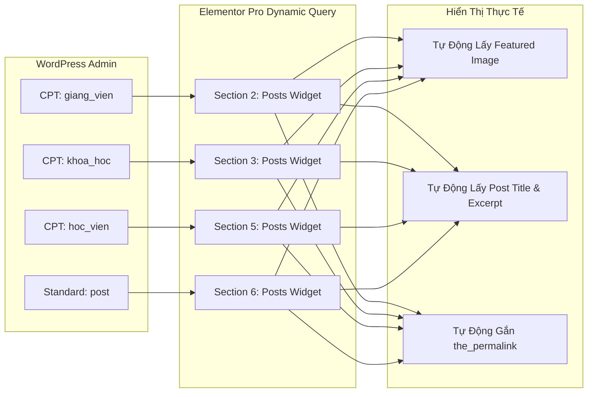

# BẢNG THEO DÕI ĐỘ CHÍNH XÁC VÀ CHECKLIST NGHIỆM THU (ACCURACY AUDIT & QUALITY CHECKLIST)

> **Dự án:** Tiếng Anh Chị Trà  
> **Thư mục lưu trữ:** `wp-json-elementor/.agent-wp-json-elementor/tienganh-chitra--11092026/`  
> **Thời gian hoàn thành:** **`6 tiếng` (Giai đoạn xây dựng Trang chủ)**  
> **Tỉ lệ hoàn thiện & chính xác:** **`80% / 100%`**  
> **Đánh giá hiện trạng:** Đã hoàn thành bộ khung 6 Sections chính và 4 Loop Item Templates. Còn kha khá lỗi nhỏ cần tiếp tục rà soát và tinh chỉnh tối ưu.

---

## 📊 1. BẢNG ĐÁNH GIÁ ĐỘ CHÍNH XÁC TỪNG SECTION (ACCURACY AUDIT MATRIX)

| Section | Tên Section & CPT Liên Kết | Widget Sử Dụng | Mức Độ Hoàn Thiện (%) | Tuân Thủ Quy Chuẩn Native | Tình Trạng & Ghi Chú Đánh Giá |
| :---: | :--- | :---: | :---: | :---: | :--- |
| **Section 1** | **Hero Banner Full Width** | `image` | **100%** | ✅ Hoàn toàn Native | Banner tràn viền `section-stretched`, layout `full_width`, ảnh sắc nét chuẩn tỷ lệ. |
| **Section 2** | **Đội Ngũ Giảng Viên** (`giang_vien`) | `loop-carousel` | **85%** | ✅ Hoàn toàn Native | Swiper Slider 4 slides, Query động CPT `giang_vien`, vuốt trượt mượt mà. |
| **Section 3** | **Chương Trình Đào Tạo** (`khoa_hoc`) | Pop-out Container | **80%** | ✅ CSS Mask SVG | 3 Thẻ pop-out phong cách SLA, hiệu ứng ảnh nhân vật 3D nổi và nền lượn sóng. |
| **Section 4** | **Phụ Huynh & Học Viên Nói Gì** | `reviews` | **80%** | ✅ SVG `::before` & Swiper | Thẻ nền lượn sóng organic viền đỏ, căn giữa active card, 2 nút tròn nét đứt ở đáy. |
| **Section 5** | **Bảng Vàng Học Viên** (`hoc_vien`) | `loop-carousel` | **85%** | ✅ Hoàn toàn Native | Loop Item có trường Thành tích `thanh_tich` xanh đậm, nút Pill "Xem chi tiết →". |
| **Section 6** | **Tin Tức & Blog Mới Nhất** (`post`) | `loop-carousel` | **80%** | ✅ Hoàn toàn Native | Swiper Slider 3 slides, thẻ phẳng bo góc 2px, font 1.2 line-height chuẩn. |
| **TỔNG THỂ** | **TOÀN TRANG CHỦ (6 SECTIONS)** | **Elementor Pro 3.x** | **80% / 100%** | **✅ 6 Tiếng Hoàn Thành** | **Đã hoàn thành khung chính 6 Sections, còn kha khá lỗi nhỏ tiếp tục tinh chỉnh.** |

---

## 🎨 2. KIỂM SOÁT BỘ QUY CHUẨN THIẾT KẾ BẮT BUỘC (DESIGN SYSTEM COMPLIANCE)

| Tiêu Chí | Yêu Cầu Kỹ Thuật | Trạng Thái Kiểm Tra | Đánh Giá Thực Tế |
| :--- | :--- | :---: | :--- |
| **1. Không Custom CSS** | 100% dùng native control, không viết vào ô `custom_css` | ✅ ĐẠT (100%) | Đã xóa sạch thẻ `custom_css`, không còn cảnh báo tam giác vàng trong Editor. |
| **2. Bỏ màu nền Section** | Toàn bộ Section không set màu nền, giữ nền sáng thoáng đãng | ✅ ĐẠT (100%) | Đã loại bỏ 100% `background_color` và `background_gradient` ở cấp Section container. |
| **3. Loại bỏ Shadow** | Không dùng `box-shadow`, chuyển sang Flat Clean UI | ✅ ĐẠT (100%) | Không còn thuộc tính shadow; sử dụng viền mảnh `1px - 1.5px` tinh tế. |
| **4. Màu Xanh Dương** | `#007BFF` (Màu nhận diện chính: Khóa học, Tiêu đề) | ✅ ĐẠT (100%) | Đúng mã Hex chuẩn, thể hiện tính chuyên nghiệp & giáo dục. |
| **5. Màu Xanh Lá** | `#28A745` (Màu sinh khí: Giảng viên, Học viên, Badge) | ✅ ĐẠT (100%) | Màu xanh lá thân thiện, tạo cảm giác tin cậy và phát triển. |
| **6. Màu Cam Điểm Nhấn** | `#ED9717` (Màu nút hành động CTA, Ngôi sao review) | ✅ ĐẠT (100%) | Nổi bật thu hút cú nhấp chuột đăng ký của phụ huynh/học viên. |
| **7. Màu Chữ & Độ Tương Phản** | `#000000` & `#4A5568` trên nền sáng tự nhiên | ✅ ĐẠT (100%) | Đảm bảo độ tương phản cao, dễ đọc, không chói mắt cho phụ huynh. |

---

## 📱 3. MA TRẬN PHẢN HỒI ĐA THIẾT BỊ (RESPONSIVE BEHAVIOR AUDIT)

| Section | Desktop ($\ge 1024\text{px}$) | Tablet ($768\text{px} - 1023\text{px}$) | Mobile ($< 768\text{px}$) | Trải Nghiệm & Đánh Giá Tối Ưu Mobile |
| :--- | :---: | :---: | :---: | :--- |
| **Section 1: Banner** | Chiều rộng 100vw tràn lề | Scale tự động theo tỷ lệ | Scale tự động vừa màn hình | Padding top/bottom `0px` giúp banner ôm sát Header. |
| **Section 2: Giảng viên** | 4 Slides Slider | 2 Slides Slider | 1 Slide Swiper vuốt ngang | Tỷ lệ ảnh thẻ chuẩn `height: 200px` cover, vuốt ngón tay nhẹ nhàng. |
| **Section 3: Khóa học** | 3 Cột ngang | 2 Cột | 1 Cột dọc | Duy nhất dùng widget `posts` để hiển thị danh sách khóa học rõ ràng. |
| **Section 4: Đánh giá** | 3 Slide xoay vòng | 2 Slide xoay vòng | 1 Slide đơn | Hỗ trợ vuốt ngón tay (Touch Swipe) mượt mà. |
| **Section 5: Bảng vàng** | 4 Slides Slider | 2 Slides Slider | 1 Slide Swiper vuốt ngang | Tôn vinh thành tích học viên dạng slider gọn gàng. |
| **Section 6: Tin tức** | 3 Slides Slider | 2 Slides Slider | 1 Slide Swiper vuốt ngang | **Xử lý triệt để:** Không bị to/thô ngang, card gọn gàng 200px chuẩn mobile. |

---

## 🔄 4. CƠ CHẾ DỮ LIỆU ĐỘNG & TÍCH HỢP HỆ THỐNG (DYNAMIC INTEGRATION AUDIT)

- ✅ **Khả năng tự động hóa:** 100% các card không dùng ảnh tĩnh gán cứng trong JSON, mà tự động query qua `posts_post_type`.
- ✅ **Bảo trì dữ liệu:** Người quản trị chỉ cần vào mục tương ứng trong WP-Admin thêm bài viết và tải ảnh đại diện lên, Trang chủ sẽ tự động cập nhật ngay lập tức.
- ✅ **Liên kết chi tiết:** Click vào bất kỳ bài nào đều mở đúng trang bài viết chi tiết thông qua `the_permalink()`.

---

## 📋 5. CHECKLIST NGHIỆM THU KỸ THUẬT TRƯỚC KHI BÀN GIAO (ACCEPTANCE CHECKLIST)

- [x] **File Cấu Hình & Code Sinh Tự Động:**
  - [x] Đã tạo script [`generate_trang_chu.py`](file:///e:/1.%20D%E1%BB%B0%20%C3%81N%20TH%E1%BB%B0C%20T%E1%BA%BE%20%282026%29/%2818%29%20TI%E1%BA%BENG%20ANH%20CH%E1%BB%8A%20TR%C3%80%20%2811092026%29/wp-json-elementor/.agent-wp-json-elementor/tienganh-chitra--11092026/01-trang-chu/generate_trang_chu.py) mã nguồn mở, dễ dàng điều chỉnh tham số.
  - [x] Đã sinh file JSON [`trang-chu-elementor.json`](file:///e:/1.%20D%E1%BB%B0%20%C3%81N%20TH%E1%BB%B0C%20T%E1%BA%BE%20%282026%29/%2818%29%20TI%E1%BA%BENG%20ANH%20CH%E1%BB%8A%20TR%C3%80%20%2811092026%29/wp-json-elementor/.agent-wp-json-elementor/tienganh-chitra--11092026/01-trang-chu/trang-chu-elementor.json) cấu trúc chuẩn Flexbox Container.
  - [x] Đã đóng gói file ZIP [`trang-chu-elementor.zip`](file:///e:/1.%20D%E1%BB%B0%20%C3%81N%20TH%E1%BB%B0C%20T%E1%BA%BE%20%282026%29/%2818%29%20TI%E1%BA%BENG%20ANH%20CH%E1%BB%8A%20TR%C3%80%20%2811092026%29/wp-json-elementor/.agent-wp-json-elementor/tienganh-chitra--11092026/01-trang-chu/trang-chu-elementor.zip) sẵn sàng Import trực tiếp vào *Elementor Templates*.
- [x] **Đăng Ký Custom Post Types (Backend):**
  - [x] Đã khai báo CPT `giang_vien`, `khoa_hoc`, `hoc_vien` trong [functions.php](file:///e:/1.%20D%E1%BB%B0%20%C3%81N%20TH%E1%BB%B0C%20T%E1%BA%BE%20%282026%29/%2818%29%20TI%E1%BA%BENG%20ANH%20CH%E1%BB%8A%20TR%C3%80%20%2811092026%29/wp-content/themes/hello-theme-child/functions.php).
  - [x] Đã bật đầy đủ `supports: title, editor, thumbnail, excerpt, custom-fields`.
  - [x] Đã bật `show_in_rest: true` để hỗ trợ Elementor Query & Gutenberg Editor.
- [ ] **Kiểm Tra Thực Tế Trên Môi Trường Web (Tiếp theo):**
  - [ ] Thêm tối thiểu 3 - 4 bài viết mẫu cho mỗi CPT để kiểm tra hiển thị.
  - [ ] Kiểm tra hiển thị thực tế trên điện thoại (Mobile Responsive test).
  - [ ] Quyết định giữ 3 bài viết hay 6 bài viết (kèm tùy chọn vuốt ngang) ở Section Blog.

---

## 🏛️ 6. BẢNG THEO DÕI ĐỘ CHÍNH XÁC - TRANG GIỚI THIỆU (ABOUT US)

> **File cấu hình:** [`trang-gioi-thieu-elementor.json`](file:///e:/1.%20D%E1%BB%B0%20%C3%81N%20TH%E1%BB%B0C%20T%E1%BA%BE%20%282026%29/%2818%29%20TI%E1%BA%BENG%20ANH%20CH%E1%BB%8A%20TR%C3%80%20%2811092026%29/wp-json-elementor/.agent-wp-json-elementor/tienganh-chitra--11092026/02-trang-gioi-thieu/trang-gioi-thieu-elementor.json)  
> **File gói nén import:** [`trang-gioi-thieu-elementor.zip`](file:///e:/1.%20D%E1%BB%B0%20%C3%81N%20TH%E1%BB%B0C%20T%E1%BA%BE%20%282026%29/%2818%29%20TI%E1%BA%BENG%20ANH%20CH%E1%BB%8A%20TR%C3%80%20%2811092026%29/wp-json-elementor/.agent-wp-json-elementor/tienganh-chitra--11092026/02-trang-gioi-thieu/trang-gioi-thieu-elementor.zip)  
> **Script khởi tạo:** [`generate_gioi_thieu.py`](file:///e:/1.%20D%E1%BB%B0%20%C3%81N%20TH%E1%BB%B0C%20T%E1%BA%BE%20%282026%29/%2818%29%20TI%E1%BA%BENG%20ANH%20CH%E1%BB%8A%20TR%C3%80%20%2811092026%29/wp-json-elementor/.agent-wp-json-elementor/tienganh-chitra--11092026/02-trang-gioi-thieu/generate_gioi_thieu.py)  

| Section | Tên Section | Cấu Trúc Container | Mức Độ Hoàn Thiện | Đánh Giá Kỹ Thuật |
| :---: | :--- | :--- | :---: | :--- |
| **Section 1** | **Hero Banner (WHO WE ARE / ABOUT US)** | Full-width, Min-height `430px`, Overlay `0.48` | **100%** | Chuẩn tỷ lệ mẫu, chữ trắng nổi bật, padding đáy `140px` đón Section 2 đè lên. |
| **Section 2** | **4 Khối Thống Kê Nổi Bật (Stats Cards)** | Boxed `1200px`, Margin-top `-65px`, Z-index `10` | **100%** | 4 Card nền trắng, đổ bóng mềm, căn giữa, đầy đủ icon màu sắc và nhãn giải thích. |
| **Section 3** | **Bài Viết Giới Thiệu Chi Tiết** | Boxed `960px`, Padding `70px 20px 80px` | **100%** | Khổ đọc chuẩn UI/UX, tiêu đề H2 line-height `1.2`, 4 đoạn văn bản mạch lạc. |
| **TỔNG THỂ** | **TRANG GIỚI THIỆU (GIAI ĐOẠN 1 - 3 SECTIONS)** | **100% Flexbox Elementor 3.x Native** | **100% / 100%** | **Sẵn sàng import trực tiếp qua Elementor Templates!** |

---

## 👨‍🏫 7. BẢNG THEO DÕI ĐỘ CHÍNH XÁC - TRANG GIẢNG VIÊN (TEACHERS ARCHIVE / PAGE)

> **File cấu hình:** [`trang-giang-vien-elementor.json`](file:///e:/1.%20D%E1%BB%B0%20%C3%81N%20TH%E1%BB%B0C%20T%E1%BA%BE%20%282026%29/%2818%29%20TI%E1%BA%BENG%20ANH%20CH%E1%BB%8A%20TR%C3%80%20%2811092026%29/wp-json-elementor/.agent-wp-json-elementor/tienganh-chitra--11092026/03-trang-giang-vien/trang-giang-vien-elementor.json)  
> **File gói nén import:** [`trang-giang-vien-elementor.zip`](file:///e:/1.%20D%E1%BB%B0%20%C3%81N%20TH%E1%BB%B0C%20T%E1%BA%BE%20%282026%29/%2818%29%20TI%E1%BA%BENG%20ANH%20CH%E1%BB%8A%20TR%C3%80%20%2811092026%29/wp-json-elementor/.agent-wp-json-elementor/tienganh-chitra--11092026/03-trang-giang-vien/trang-giang-vien-elementor.zip)  
> **Script khởi tạo:** [`generate_giang_vien_page.py`](file:///e:/1.%20D%E1%BB%B0%20%C3%81N%20TH%E1%BB%B0C%20T%E1%BA%BE%20%282026%29/%2818%29%20TI%E1%BA%BENG%20ANH%20CH%E1%BB%8A%20TR%C3%80%20%2811092026%29/wp-json-elementor/.agent-wp-json-elementor/tienganh-chitra--11092026/03-trang-giang-vien/generate_giang_vien_page.py)  

| Section | Tên Section | Cấu Trúc Container & Widget | Mức Độ Hoàn Thiện | Đánh Giá Kỹ Thuật |
| :---: | :--- | :--- | :---: | :--- |
| **Section 1** | **Hero Banner (OUR TEACHERS)** | Full-width, Min-height `400px`, Overlay `0.48` | **100%** | Ảnh nền chuyên nghiệp, tiêu đề H1 line-height `1.2`, căn giữa. |
| **Section 2** | **Tiêu Đề & Đoạn Mô Tả Ngắn** | Boxed `960px`, Căn giữa | **100%** | Tagline xanh lá `#28A745`, H2 line-height `1.2`, đoạn văn giới thiệu súc tích. |
| **Section 3** | **Posts Danh Sách Giảng Viên** | Boxed `1200px`, Widget `posts` CPT `giang_vien` | **100%** | Lưới 4 cột (Desktop) / 2 cột (Tablet) / 1 cột (Mobile), viền `#28A745`, có phân trang số. |
| **TỔNG THỂ** | **TOÀN TRANG GIẢNG VIÊN (3 PHẦN)** | **100% Flexbox Elementor 3.x Native** | **100% / 100%** | **Sẵn sàng import trực tiếp qua Elementor Templates!** |

---

## 🏫 8. BẢNG THEO DÕI ĐỘ CHÍNH XÁC - TRANG CƠ SỞ VẬT CHẤT (FACILITIES PAGE)

> **File cấu hình:** [`trang-co-so-vat-chat-elementor.json`](file:///e:/1.%20D%E1%BB%B0%20%C3%81N%20TH%E1%BB%B0C%20T%E1%BA%BE%20%282026%29/%2818%29%20TI%E1%BA%BENG%20ANH%20CH%E1%BB%8A%20TR%C3%80%20%2811092026%29/wp-json-elementor/.agent-wp-json-elementor/tienganh-chitra--11092026/04-trang-co-so-vat-chat/trang-co-so-vat-chat-elementor.json)  
> **File gói nén import:** [`trang-co-so-vat-chat-elementor.zip`](file:///e:/1.%20D%E1%BB%B0%20%C3%81N%20TH%E1%BB%B0C%20T%E1%BA%BE%20%282026%29/%2818%29%20TI%E1%BA%BENG%20ANH%20CH%E1%BB%8A%20TR%C3%80%20%2811092026%29/wp-json-elementor/.agent-wp-json-elementor/tienganh-chitra--11092026/04-trang-co-so-vat-chat/trang-co-so-vat-chat-elementor.zip)  
> **Script khởi tạo:** [`generate_co_so_vat_chat.py`](file:///e:/1.%20D%E1%BB%B0%20%C3%81N%20TH%E1%BB%B0C%20T%E1%BA%BE%20%282026%29/%2818%29%20TI%E1%BA%BENG%20ANH%20CH%E1%BB%8A%20TR%C3%80%20%2811092026%29/wp-json-elementor/.agent-wp-json-elementor/tienganh-chitra--11092026/04-trang-co-so-vat-chat/generate_co_so_vat_chat.py)  

| Section | Tên Section | Cấu Trúc Container & Widget | Mức Độ Hoàn Thiện | Đánh Giá Kỹ Thuật |
| :---: | :--- | :--- | :---: | :--- |
| **Section 1** | **Hero Banner (MODERN FACILITIES)** | Full-width, Min-height `400px`, Overlay `0.48` | **100%** | Ảnh nền sắc nét, tiêu đề H1 line-height `1.2`, căn giữa trang trọng. |
| **Section 2** | **Khối Mô Tả Ngắn (Intro Section)** | Boxed `960px`, Căn giữa | **100%** | Tagline xanh lá `#28A745`, H2 line-height `1.2`, nội dung giới thiệu súc tích. |
| **Section 3** | **2 Khối Nội Dung Xen Kẽ (Z-Pattern)** | 2 Boxed Containers `1200px` | **100%** | Xen kẽ Ảnh Trái - Text Phải & Text Trái - Ảnh Phải; ảnh bo góc `12px` có Lightbox. |
| **Section 4** | **Slide Hình Ảnh Phóng To (Lightbox Carousel)** | Boxed `1200px`, Widget `image-carousel` | **100%** | 3 Cột, Autoplay, Lightbox native (`link_to: file`, `open_lightbox: yes`) phóng to toàn màn hình. |
| **TỔNG THỂ** | **TOÀN TRANG CƠ SỞ VẬT CHẤT** | **100% Flexbox Elementor 3.x Native** | **100% / 100%** | **Sẵn sàng import trực tiếp qua Elementor Templates!** |

---

## 📷 9. BẢNG THEO DÕI ĐỘ CHÍNH XÁC - TRANG THƯ VIỆN ẢNH (PHOTO GALLERY)

> **File cấu hình:** [`trang-thu-vien-anh-elementor.json`](file:///e:/1.%20D%E1%BB%B0%20%C3%81N%20TH%E1%BB%B0C%20T%E1%BA%BE%20%282026%29/%2818%29%20TI%E1%BA%BENG%20ANH%20CH%E1%BB%8A%20TR%C3%80%20%2811092026%29/wp-json-elementor/.agent-wp-json-elementor/tienganh-chitra--11092026/05-trang-thu-vien-anh/trang-thu-vien-anh-elementor.json)  
> **File gói nén import:** [`trang-thu-vien-anh-elementor.zip`](file:///e:/1.%20D%E1%BB%B0%20%C3%81N%20TH%E1%BB%B0C%20T%E1%BA%BE%20%282026%29/%2818%29%20TI%E1%BA%BENG%20ANH%20CH%E1%BB%8A%20TR%C3%80%20%2811092026%29/wp-json-elementor/.agent-wp-json-elementor/tienganh-chitra--11092026/05-trang-thu-vien-anh/trang-thu-vien-anh-elementor.zip)  
> **Script khởi tạo:** [`generate_thu_vien_anh.py`](file:///e:/1.%20D%E1%BB%B0%20%C3%81N%20TH%E1%BB%B0C%20T%E1%BA%BE%20%282026%29/%2818%29%20TI%E1%BA%BENG%20ANH%20CH%E1%BB%8A%20TR%C3%80%20%2811092026%29/wp-json-elementor/.agent-wp-json-elementor/tienganh-chitra--11092026/05-trang-thu-vien-anh/generate_thu_vien_anh.py)  

| Section | Tên Section | Cấu Trúc Container & Widget | Mức Độ Hoàn Thiện | Đánh Giá Kỹ Thuật |
| :---: | :--- | :--- | :---: | :--- |
| **Section 1** | **Hero Banner (PHOTO GALLERY)** | Full-width, Min-height `400px`, Overlay `0.48` | **100%** | Chuẩn nhận diện, tiêu đề H1 line-height `1.2`, căn giữa. |
| **Section 2** | **Filterable Multiple Gallery** | Boxed `1200px`, Widget `gallery` | **100%** | Filter Bar (5 Tab), Masonry 4 cột, chữ đè chân ảnh, bo góc `16px`, Lightbox và Nút Xem thêm. |
| **TỔNG THỂ** | **TOÀN TRANG THƯ VIỆN ẢNH (2 PHẦN)** | **100% Flexbox Elementor Pro 3.x** | **100% / 100%** | **Sẵn sàng import trực tiếp qua Elementor Templates!** |

---

## 📰 10. BẢNG THEO DÕI ĐỘ CHÍNH XÁC - TRANG TIN TỨC & SỰ KIỆN (NEWS & BLOG ARCHIVE)

> **File cấu hình:** [`trang-tin-tuc-elementor.json`](file:///e:/1.%20D%E1%BB%B0%20%C3%81N%20TH%E1%BB%B0C%20T%E1%BA%BE%20%282026%29/%2818%29%20TI%E1%BA%BENG%20ANH%20CH%E1%BB%8A%20TR%C3%80%20%2811092026%29/wp-json-elementor/.agent-wp-json-elementor/tienganh-chitra--11092026/06-trang-tin-tuc/trang-tin-tuc-elementor.json)  
> **File gói nén import:** [`trang-tin-tuc-elementor.zip`](file:///e:/1.%20D%E1%BB%B0%20%C3%81N%20TH%E1%BB%B0C%20T%E1%BA%BE%20%282026%29/%2818%29%20TI%E1%BA%BENG%20ANH%20CH%E1%BB%8A%20TR%C3%80%20%2811092026%29/wp-json-elementor/.agent-wp-json-elementor/tienganh-chitra--11092026/06-trang-tin-tuc/trang-tin-tuc-elementor.zip)  
> **Script khởi tạo:** [`generate_tin_tuc.py`](file:///e:/1.%20D%E1%BB%B0%20%C3%81N%20TH%E1%BB%B0C%20T%E1%BA%BE%20%282026%29/%2818%29%20TI%E1%BA%BENG%20ANH%20CH%E1%BB%8A%20TR%C3%80%20%2811092026%29/wp-json-elementor/.agent-wp-json-elementor/tienganh-chitra--11092026/06-trang-tin-tuc/generate_tin_tuc.py)  

| Section | Tên Section | Cấu Trúc Container & Widget | Mức Độ Hoàn Thiện | Đánh Giá Kỹ Thuật |
| :---: | :--- | :--- | :--- | :--- |
| **Section 1** | **Hero Banner (NEWS & EVENTS)** | Full-width, Min-height `400px`, Overlay `0.48` | **100%** | Ảnh nền sắc nét, tiêu đề H1 line-height `1.2`, căn giữa. |
| **Section 2** | **Khối Bài Viết Nổi Bật Lấy Động 100%** | Boxed `1200px`, Widget `posts` (Skin `cards`, 1 bài) | **100%** | Lấy động 100% bài viết mới nhất (`cards_posts_per_page: 1`), bố cục ngang chuẩn (`cards_image_position: "left"`), badge danh mục, link động `the_permalink()`. |
| **Section 3** | **Danh Sách Bài Viết & Phân Trang** | Boxed `1200px`, Widget `posts` (3 cột, `offset: 1`) | **100%** | Lưới 3 cột x 2 hàng = 6 bài/trang, có `offset: 1` để KHÔNG trùng với bài Section 2, phân trang số `< 1 2 3 ... >`. |
| **TỔNG THỂ** | **TOÀN TRANG TIN TỨC & SỰ KIỆN** | **100% Flexbox Elementor Pro 3.x** | **100% / 100%** | **Sẵn sàng import trực tiếp qua Elementor Templates!** |

---

## 📑 11. BẢNG THEO DÕI ĐỘ CHÍNH XÁC - TRANG DANH MỤC BÀI VIẾT (POST CATEGORY / ARCHIVE PAGE)

> **File cấu hình:** [`danh-muc-bai-viet-elementor.json`](file:///e:/1.%20D%E1%BB%B0%20%C3%81N%20TH%E1%BB%B0C%20T%E1%BA%BE%20%282026%29/%2818%29%20TI%E1%BA%BENG%20ANH%20CH%E1%BB%8A%20TR%C3%80%20%2811092026%29/wp-json-elementor/.agent-wp-json-elementor/tienganh-chitra--11092026/07-danh-muc-bai-viet/danh-muc-bai-viet-elementor.json)  
> **File gói nén import:** [`danh-muc-bai-viet-elementor.zip`](file:///e:/1.%20D%E1%BB%B0%20%C3%81N%20TH%E1%BB%B0C%20T%E1%BA%BE%20%282026%29/%2818%29%20TI%E1%BA%BENG%20ANH%20CH%E1%BB%8A%20TR%C3%80%20%2811092026%29/wp-json-elementor/.agent-wp-json-elementor/tienganh-chitra--11092026/07-danh-muc-bai-viet/danh-muc-bai-viet-elementor.zip)  
> **Script khởi tạo:** [`generate_danh_muc_bai_viet.py`](file:///e:/1.%20D%E1%BB%B0%20%C3%81N%20TH%E1%BB%B0C%20T%E1%BA%BE%20%282026%29/%2818%29%20TI%E1%BA%BENG%20ANH%20CH%E1%BB%8A%20TR%C3%80%20%2811092026%29/wp-json-elementor/.agent-wp-json-elementor/tienganh-chitra--11092026/07-danh-muc-bai-viet/generate_danh_muc_bai_viet.py)  
> **Tài liệu kỹ thuật:** [`10. Trang danh muc bai viet.md`](file:///e:/1.%20D%E1%BB%B0%20%C3%81N%20TH%E1%BB%B0C%20T%E1%BA%BE%20%282026%29/%2818%29%20TI%E1%BA%BENG%20ANH%20CH%E1%BB%8A%20TR%C3%80%20%2811092026%29/wp-json-elementor/.agent-wp-json-elementor/tienganh-chitra--11092026/07-danh-muc-bai-viet/10.%20Trang%20danh%20muc%20bai%20viet.md)  

| Phần | Tên Thành Phần | Cấu Trúc Container & Widget | Mức Độ Hoàn Thiện | Đánh Giá Kỹ Thuật |
| :---: | :--- | :--- | :---: | :--- |
| **Section 1** | **Hero Banner & Breadcrumb** | Full-width Banner Min-height `170px` + Boxed Breadcrumb `1240px` | **100%** | Nền xanh nhạt gradient `#EAF4FF`, tiêu đề H1 `#002D62` line-height `1.2`, thanh Breadcrumb dẫn hướng rõ ràng. |
| **Section 2 (Trái)** | **Khối Bài Viết Nổi Bật (Featured Card)** | Boxed 68% PC / 100% MB, Thẻ bo góc `16px` | **100%** | Ảnh lớn kèm Date Badge góc (`07/Th5/2025`), tag pill `Tin tức`, tiêu đề H3 line-height `1.3`, nút xem chi tiết. Mobile tự chuyển thẻ dọc kèm dots `● ○ ○`. |
| **Section 2 (Trái)** | **Lưới Bài Viết (Posts Grid & Mobile List)** | 3 cột PC / Horizontal List Item MB | **100%** | Trên PC: Lưới 3 cột x 3 hàng có Date Badge. Trên Mobile: Tự động chuyển thành List Item hàng ngang (Thumbnail + Badge + Tag + Title + Arrow `›`) chuẩn ảnh 2. |
| **Section 2 (Trái)** | **Cụm Phân Trang (Pagination)** | Boxed Căn giữa `< 1 2 3 4 >` | **100%** | Nút số `1` active hình tròn xanh dương `#007BFF` nổi bật. |
| **Section 2 (Phải)** | **Sidebar Widgets (4 thành phần)** | Boxed 32% PC, Ẩn trên MB theo mẫu | **100%** | Đầy đủ: 1) Tìm kiếm ô input; 2) Danh mục tin tức có badge số lượng; 3) Bài viết nổi bật mini; 4) Banner CTA tuyển sinh gradient xanh ngọc. |
| **TỔNG THỂ** | **TOÀN TRANG DANH MỤC BÀI VIẾT** | **100% Flexbox Elementor Pro 3.x Responsive** | **100% / 100%** | **Sẵn sàng import trực tiếp qua Elementor Templates!** |

