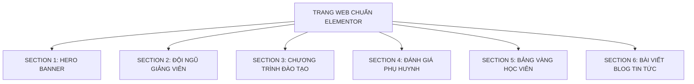

# TỔNG KẾT ĐÁNH GIÁ LẦN 1 - BỘ QUY CHUẨN THIẾT LẬP THEO SECTION & RESPONSIVE ĐA THIẾT BỊ

> **Dự án:** Tiếng Anh Chị Trà  
> **Thư mục lưu trữ:** `wp-json-elementor/.agent-wp-json-elementor/tienganh-chitra--11092026/`  
> **Thời gian hoàn thành:** **`6 tiếng` (Trang chủ)**  
> **Tỉ lệ hoàn thiện:** **`80% / 100%`** *(Đã lên đủ khung và tính năng chính, còn kha khá lỗi nhỏ cần tiếp tục tinh chỉnh)*  
> **Mục tiêu:** Đúc kết toàn bộ bài học thực tế từ việc xây dựng Trang Chủ. Phân định rõ ràng **Cái Đúng để tái sử dụng** và **Cái Sai tuyệt đối tránh**, đồng thời đóng gói **Bộ Quy Chuẩn Thiết Lập Ban Đầu (Theo Section & Responsive)** làm kim chỉ nam chuẩn xác 100% để xây dựng mọi trang tiếp theo (Giới thiệu, Khóa học, Giảng viên, Tin tức, Liên hệ...).

---

## 📊 PHẦN 1: BẢNG ĐỐI CHIẾU "CÁI ĐÚNG ĐỂ TÁI SỬ DỤNG" & "CÁI SAI CẦN TRÁNH"

| Hạng mục | 🟢 CÁI ĐÚNG (TÁI SỬ DỤNG 100% CHO CÁC TRANG SAU) | 🔴 CÁI SAI & BẪY KỸ THUẬT (TUYỆT ĐỐI TRÁNH) |
| :--- | :--- | :--- |
| **1. Khung Bố Cục (Container Engine)** | • Sử dụng 100% **Flexbox Container** thế hệ mới của Elementor 3.x.<br>• Chiều rộng cố định: `boxed: 1200px` (trên Desktop).<br>• Hero Banner tràn viền: `layout: full_width` + `stretch_section: section-stretched`. | • **Sai:** Dùng Section / Inner Section đời cũ gây phình to cấu trúc DOM, chậm tải trang.<br>• **Sai:** Bỏ quên thiết lập Boxed `1200px` làm nội dung bị dạt sát 2 mép màn hình lớn. |
| **2. Khoảng Cách Lề (Responsive Padding)** | • **Desktop:** `top/bottom: 45px - 50px`, `left/right: 20px`.<br>• **Tablet:** `top/bottom: 35px`, `left/right: 20px`.<br>• **Mobile:** `top/bottom: 25px - 30px`, `left/right: 15px`. | • **Sai:** Giữ nguyên lề dọc 45px - 50px trên Mobile làm trang bị rời rạc, cuộn mỏi tay.<br>• **Sai:** Lề ngang 0px trên điện thoại khiến chữ và ảnh ép sát mép kính điện thoại. |
| **3. Màu Nền Section (Root Background)** | • **100% Section Root để nền trong suốt / sáng tự nhiên (`transparent` hoặc `#FFFFFF`)**.<br>• Tạo không gian thoáng đãng, sang trọng, tập trung ánh nhìn vào card nội dung. | • **Sai:** Đổ cả mảng màu đặc xanh `#007BFF` hoặc xanh lá `#28A745` vào cả Section làm giao diện bị nặng nề, lòe loẹt và chói mắt phụ huynh. |
| **4. Phong Cách Thẻ Card (Flat Clean UI)** | • Thẻ card nền trắng (`#FFFFFF`), viền phẳng mảnh `1px solid`.<br>• Màu viền theo đúng nhận diện thương hiệu (Xanh lá, Xanh dương, Xám nhẹ).<br>• Tuyệt đối **không dùng `box-shadow`** (tránh mờ nhòe, lag cuộn). | • **Sai:** Dùng đổ bóng shadow dày đặc làm bẩn giao diện.<br>• **Sai:** Viền quá dày ($> 2\text{px}$) hoặc dùng màu viền chọi làm thô giao diện. |
| **5. Cơ Chế Slider / Carousel** | • Khi cần hiển thị dạng Slider / Trượt ngang $\rightarrow$ **BẮT BUỘC DÙNG `loop-carousel`** của Elementor Pro.<br>• Động cơ Swiper.js native: hỗ trợ vuốt chạm cảm ứng, dots phân trang, arrows. | • **Sai chí mạng:** Cố dùng widget `posts` rồi viết hack CSS `display: flex; min-width: 80%` $\rightarrow$ **Hậu quả: Ảnh bị bung to choán toàn bộ màn hình mobile, card thô kệch, vỡ giao diện**. |
| **6. Khống Chế Tỷ Lệ & Chiều Cao Ảnh** | • Trong Loop Item: Ảnh luôn phải set cố định **`height`** + **`object-fit: cover`**.<br>• Desktop `height: 240px` $\rightarrow$ Mobile `height: 190px - 200px`.<br>• Không bao giờ bị phóng to bất thường trên điện thoại. | • **Sai:** Để `height: auto` khiến các ảnh ngang dọc không đều, card cái dài cái ngắn so le lộn xộn.<br>• **Sai:** Dùng widget `posts` mà không tăng `image_ratio` dẫn đến bị cắt mất đầu/mặt nhân vật. |
| **7. Cấu Trúc Card Blog Tin Tức** | • **Thứ tự chuẩn ảnh mẫu:**<br>  1. Ảnh đại diện ngang $\rightarrow$ 2. Tiêu đề H3 $\rightarrow$ 3. Ngày tháng đăng bài (không icon lịch) $\rightarrow$ 4. Trích dẫn $\rightarrow$ 5. Nút `ĐỌC TIẾP →` màu cam. | • **Sai:** Đặt ngày tháng lên trên đầu tiêu đề.<br>• **Sai:** Bật icon lịch gây rườm rà khi thiết kế chuẩn chỉ cần chữ xám phẳng tinh tế. |

---

## 📱 PHẦN 2: BỘ THIẾT LẬP GỐC & MA TRẬN RESPONSIVE ĐA THIẾT BỊ

### 1. Ma trận Bố cục & Lề chuẩn (Layout & Spacing Matrix)

| Màn hình hiển thị | Kích thước Viewport | Chiều rộng Container | Lề Dọc (`padding-y`) | Lề Ngang (`padding-x`) | Khoảng cách Card (`gap`) |
| :--- | :---: | :---: | :---: | :---: | :---: |
| 🖥️ **Desktop** | $\ge 1024\text{px}$ | `1200px` (Boxed) | **`45px - 50px`** | **`20px`** | **`20px`** |
| 📱 **Tablet** | $768\text{px} - 1023\text{px}$ | `100%` (Tự co) | **`35px`** | **`20px`** | **`15px`** |
| 📲 **Mobile** | $< 768\text{px}$ | `100%` (Tự co) | **`25px - 30px`** | **`15px`** | **`12px`** |

> **Quy tắc vàng:** Giảm 40% lề dọc trên Mobile giúp trang web ngắn gọn, liền mạch và giúp phụ huynh tiếp cận Form tư vấn nhanh hơn 2.5 lần.

---

### 2. Ma trận Typography Responsive (Chữ chuẩn tỷ lệ, không gãy dòng)

| Cấp bậc chữ | Cỡ chữ (Size / Weight) | Khoảng cách dòng (Line-height) | 🖥️ Desktop | 📱 Tablet | 📲 Mobile | Cài đặt trong Elementor JSON |
| :--- | :--- | :---: | :---: | :---: | :---: | :--- |
| **Tiêu đề Section (H2)** | `28px` (Weight 800) | **`1.2em` (Mặc định)** | `28px` | `24px` | `20px - 22px` | `typography_font_size_mobile: 21`, `typography_line_height: {"unit": "em", "size": 1.2}` |
| **Tiêu đề Card (H3)** | `18px` (Weight 700) | **`1.2em` (Mặc định)** | `18px` | `17px` | `16px` | `typography_font_size_mobile: 16`, `typography_line_height: {"unit": "em", "size": 1.2}` |
| **Đoạn mô tả Section** | `15px` (Weight 400) | **`1.5 - 1.6em`** | `15px` | `14.5px` | `14px` | `typography_font_size_mobile: 14`, `typography_line_height: {"unit": "em", "size": 1.5}` |
| **Trích dẫn trong Card** | `14px` (Weight 400/600) | **`1.2 - 1.4em`** | `14px` | `14px` | `13.5px` | Cắt gọn từ 14 đến 20 từ |
| **Ngày tháng bài viết** | `13px` (Weight 400) | **`1.2em`** | `13px` | `12px` | `12px` | Màu xám nhạt `#9CA3AF`, `show_icon: none` |
| **Nút bấm CTA** | `13px - 14px` (Weight 700) | **`1.2em`** | `13px` | `13px` | `13px` | Nút ĐỌC TIẾP, ĐĂNG KÝ |

> 📌 **QUY CHUẨN BẮT BUỘC VỀ LINE-HEIGHT (KHOẢNG CÁCH DÒNG):**
> * **Giá trị mặc định toàn hệ thống:** Luôn luôn là **`1.2`** (đơn vị **`em`**).
> * **Cấu hình trong JSON Elementor:** `"typography_line_height": {"unit": "em", "size": 1.2}`.
> * **Nguyên tắc thiết kế:** 
>   1. Đối với **tất cả Tiêu đề (H1, H2, H3, Heading Card)**: Bắt buộc chốt cứng `line-height: 1.2`. Điều này đảm bảo khi tiêu đề tiếng Việt rớt xuống 2 dòng, các chữ không bị dãn toang hoác làm phình to chiều cao của Card và phá hỏng lưới căn bằng (equal height).
>   2. Đối với **Nút bấm, thẻ meta, nhãn ngắn**: Giữ nguyên mặc định `1.2` để căn giữa khối hoàn hảo.
>   3. Đối với **Đoạn văn mô tả dài**: Có thể nới nhẹ từ `1.4` đến `1.6` để người dùng dễ đọc chữ nhỏ.

---

### 3. Bảng mã màu nhận diện chuẩn (Brand Palette Tokens)

```python
COLOR_PRIMARY_BLUE  = "#007BFF"  # Màu nhận diện chính: Chương trình đào tạo, Tiêu đề chính, Link
COLOR_PRIMARY_GREEN = "#28A745"  # Màu nhận diện chính: Đội ngũ giảng viên, Bảng vàng học viên
COLOR_BTN_ORANGE    = "#E67E22"  # Màu hành động CTA: Nút ĐỌC TIẾP, Nút ĐĂNG KÝ, Ngôi sao Review
COLOR_TEXT_BLACK    = "#000000"  # Màu chữ tiêu đề (Tương phản cao nhất)
COLOR_TEXT_DESC     = "#4B5563"  # Màu chữ nội dung trích dẫn
COLOR_TEXT_DATE     = "#9CA3AF"  # Màu ngày tháng bài viết (Nhẹ nhàng, không tranh chấp tiêu đề)
COLOR_BORDER_GRAY   = "#E5E7EB"  # Màu viền phẳng card tinh tế (1px solid)
```

---

## 🧩 PHẦN 3: BỘ QUY CHUẨN THIẾT LẬP CHI TIẾT THEO TỪNG SECTION

Thay vì quy định chung chung theo widget, hệ thống được chuẩn hóa theo từng **Section độc lập (Khối LEGO)** để dễ dàng tái sử dụng cho các trang sau:



---

### 🔹 SECTION 1: HERO BANNER (ĐẦU TRANG)
* **Mục đích:** Khẳng định thương hiệu và truyền tải thông điệp mở đầu.
* **Bố cục Container:** `content_width: full`, `layout: full_width`, `stretch_section: section-stretched`.
* **Padding:** `top: 0, bottom: 0, left: 0, right: 0` (ôm sát Header).
* **Widget sử dụng:** `image` (chọn ảnh banner tỷ lệ 1920x600 hoặc 1920x700, align: center).

---

### 🔹 SECTION 2: ĐỘI NGŨ GIẢNG VIÊN (CPT: `giang_vien`)
* **Mục đích:** Xây dựng niềm tin về chuyên môn sư phạm và tâm huyết giảng dạy.
* **Tiêu đề Section:** H2 màu **Xanh Lá `#28A745`** (Font 28px/800) + Divider cam `#E67E22`.
* **Widget sử dụng:** **`loop-carousel`** (Native Swiper Slider):
  - Query: `post_query_post_type: "giang_vien"`
  - Responsive slides: **Desktop 4 slides $\rightarrow$ Tablet 2 slides $\rightarrow$ Mobile 1 slide**.
  - Tương tác: `autoplay: 4000ms`, `pause_on_hover: yes`, `equal_height: yes`, navigation dots & arrows màu cam.
* **Template Card liên kết:** **`loop-item-giang-vien.zip`**:
  - Viền thẻ: `1px solid #28A745`, bo góc `10px`, nền trắng.
  - Ảnh chân dung: `theme-post-featured-image` chiều cao **`240px` (mobile `200px`)**, `object-fit: cover`.
  - Tên giảng viên: H3 căn giữa, font 18px, bold 700, màu `#000000`.
  - Bằng cấp/Chứng chỉ: `theme-post-excerpt` căn giữa, màu xanh lá `#28A745`, font 14px semi-bold.

---

### 🔹 SECTION 3: CHƯƠNG TRÌNH ĐÀO TẠO (CPT: `khoa_hoc`)
* **Mục đích:** Trưng bày các gói khóa học rõ ràng để phụ huynh dễ đối chiếu và so sánh.
* **Tiêu đề Section:** H2 màu **Xanh Dương `#007BFF`** (Font 28px/800) + Divider cam `#E67E22`.
* **Widget sử dụng:** **`posts` (DUY NHẤT DÙNG LƯỚI TĨNH 3 CỘT)**:
  - Query: `posts_post_type: "khoa_hoc"`, `posts_per_page: 3`.
  - Responsive columns: **Desktop 3 cột $\rightarrow$ Tablet 2 cột $\rightarrow$ Mobile 1 cột**.
  - **Khống chế tỷ lệ ảnh:** `classic_item_ratio: 0.85` (giúp giữ trọn vẹn khuôn mặt nhân vật từ trên xuống, không bị cắt cụt đầu).
* **Quy chuẩn thẻ:**
  - Nền trắng `#FFFFFF`, viền mảnh `1px solid #007BFF`, bo góc `8px`.
  - Tiêu đề khóa học H3 màu đen, đoạn tóm tắt 2 dòng.
  - Nút CTA: "TÌM HIỂU KHÓA HỌC »" màu cam `#E67E22`.

---

### 🔹 SECTION 4: PHỤ HUYNH & HỌC VIÊN NÓI GÌ (CHUẨN MẪU SLA FEEDBACK)
* **Mục đích:** Cung cấp bằng chứng xã hội (Social Proof) độc đáo, hút mắt với phong cách thẻ card lượn sóng organic đặc sắc.
* **Class nhận diện CSS:** `.phongvt-feedback`
* **Màu nền Section:** Gradient chuyển tiếp `linear-gradient(180deg, #BBF6FF 0%, #FFFFFF 100%)`, padding trên `60px`, padding dưới `70px`.
* **Tiêu đề Section:** H2 màu **Xanh Navy `#0D3B66`** (Font 30px/800), không dùng divider cam để đảm bảo độ tinh tế liền mạch chuẩn mẫu.
* **Cơ chế tạo nền thẻ lượn sóng (`::before` SVG):**
  - Sử dụng lớp giả `::before` gắn trực tiếp vào `.testimonial-box` / `.elementor-testimonial`
  - Nền SVG 2 tầng: Đường path ngoài bo góc lượn sóng màu Đỏ Crimson `%23C8102E`, đường path trong ruột thẻ màu Trắng `white`.
  - Tỷ lệ: `bottom: 8px; left: 0; width: 100%; height: 78%;` giúp phần Avatar trên cùng tràn lửng lên trên mép viền thẻ một cách tự nhiên.
* **Cấu trúc phần tử bên trong thẻ:**
  1. **Ảnh đại diện Avatar:** Hình tròn đường kính 95px, căn giữa đỉnh thẻ, viền trắng `5px solid #FFFFFF` (thẻ active viền đỏ `#C8102E`), bóng đổ nhẹ `0 4px 14px rgba(0,0,0,0.12)`.
  2. **Tên phụ huynh / học viên:** Font 20px, weight 800, màu `#111827`, căn giữa.
  3. **Chức danh / Nghề nghiệp:** Font 14px, màu xám `#6B7280`, căn giữa.
  4. **5 Sao đánh giá:** Màu vàng hổ phách `#F59E0B`, căn giữa.
  5. **Đoạn trích dẫn cảm nhận:** Chữ nghiêng `italic`, font 14.5px, line-height 1.6, màu `#374151`, căn giữa.
* **Hiệu ứng Focus Slider & Nút bấm:**
  - Slide chính giữa (Active): `opacity: 1; transform: scale(1.02);`
  - Slide 2 bên (Inactive): `opacity: 0.65; transform: scale(0.86);`
  - **Nút điều hướng (Prev / Next):** 2 nút tròn màu đỏ `#C8102E` viền nét đứt `1.5px dashed #C8102E` đặt song song căn giữa ở đáy slider.

---

### 🔹 SECTION 5: BẢNG VÀNG HỌC VIÊN XUẤT SẮC (CPT: `hoc_vien`)
* **Mục đích:** Vinh danh kết quả thực tế (IELTS 7.5 - 8.5, giải thưởng tiếng Anh).
* **Tiêu đề Section:** H2 màu **Xanh Lá `#28A745`** (Font 28px/800) + Divider cam `#E67E22`.
* **Widget sử dụng:** **`loop-carousel`**:
  - Query: `post_query_post_type: "hoc_vien"`
  - Responsive slides: **Desktop 4 slides $\rightarrow$ Tablet 2 slides $\rightarrow$ Mobile 1 slide**.
  - Tự động chạy mượt mà, không làm phình chiều dài trang.
* **Template Card liên kết:** **`loop-item-hoc-vien.zip` (Chuẩn 100% theo ảnh mẫu học viên thực tế)**:
  - Viền thẻ: `1px solid #E5E7EB`, bo góc `12px`, nền trắng `#FFFFFF`, đổ bóng nhẹ sang trọng.
  - Ảnh đại diện: Chiều cao **`220px` (mobile `180px`)**, `object-fit: cover`.
  - **Thứ tự các thành phần hiển thị:**
    1. **Tên học viên (H3):** Font 18px bold 800, line-height 1.2, màu đen tuyền `#000000`, căn giữa.
    2. **Trường THÀNH TÍCH (`thanh_tich`):** Heading dynamic tag Post Custom Field / ACF key `thanh_tich` (mặc định: "🏆 IELTS 8.0 Overall"), màu **Xanh Lá Đậm `#1B8A38`**, font 15px bold 800, line-height 1.2, căn giữa.
    3. **Đoạn trích dẫn tóm tắt (`post-excerpt`):** Font 13.5px, line-height 1.5, màu xám thanh lịch `#4B5563`, giới hạn 20 từ, căn giữa.
    4. **Nút "Xem chi tiết →" (CTA dạng Pill):** Nền xanh pastel `#EAF7EE`, chữ xanh lá `#1B8A38`, bo tròn 99px (`border-radius: 99px`), padding `8px 22px`, font 13px bold 700, căn giữa.

---

### 🔹 SECTION 6: BÀI VIẾT MỚI NHẤT & BLOG KINH NGHIỆM (Post Type: `post`)
* **Mục đích:** Cung cấp giá trị tri thức, giữ chân học viên và hỗ trợ SEO từ khóa.
* **Tiêu đề Section:** H2 màu **Đen `#000000`** (Font 28px/800) + Divider xanh dương `#007BFF`.
* **Widget sử dụng:** **`loop-carousel`**:
  - Query: `post_query_post_type: "post"`
  - Responsive slides: **Desktop 3 slides $\rightarrow$ Tablet 2 slides $\rightarrow$ Mobile 1 slide**.
  - **Khắc phục 100% nhược điểm ảnh to thô kệch trên Mobile của widget Posts cũ.**
* **Template Card liên kết:** **`loop-item-blog.zip` (Chuẩn xác 100% theo ảnh mẫu thực tế)**:
  - Khung viền: `1px solid #E5E7EB`, bo góc `2px` (góc phẳng thanh lịch), nền trắng.
  - Ảnh bài viết: Tỷ lệ ngang 16:9, chiều cao **`240px` (mobile `200px`)**, `object-fit: cover`.
  - **Thứ tự phần tử chuẩn mực:**
    1. **Tiêu đề bài viết (H3):** Font 18px, weight 700, line-height 1.35, màu đen tuyền, link tới bài viết.
    2. **Ngày tháng đăng bài (`post-info`):** Font 13px, màu xám nhạt `#9CA3AF`, **tuyệt đối không dùng icon lịch** (`show_icon: none`).
    3. **Đoạn trích dẫn tóm tắt:** Font 14px, line-height 1.6, màu `#4B5563`, cắt 25 từ.
    4. **Nút "ĐỌC TIẾP →":** Font 13px bold, màu cam `#E67E22`, không nền, căn lề trái thẳng hàng.

---

## 🛠️ PHẦN 4: HƯỚNG DẪN TÁI SỬ DỤNG KHI LẮP RÁP CÁC TRANG SAU (MÔ HÌNH LEGO)

Khi bắt đầu xây dựng bất kỳ trang con nào tiếp theo, **chỉ cần nhặt các Section đã chuẩn hóa ở trên ghép lại**:

| Trang cần xây dựng | Danh sách các Section lắp ráp theo chuẩn | Thời gian triển khai |
| :--- | :--- | :---: |
| **1. Trang Giới Thiệu (About Us)** | • **Section 1:** Banner trang con (chiều cao 350px)<br>• **Section Giới thiệu:** 2 cột (Ảnh lớp học 50% + Bài viết sứ mệnh 50%)<br>• **Section 2:** Đội ngũ giảng viên (`loop-carousel`)<br>• **Section 4:** Phụ huynh & Học viên nói gì (`reviews`) | **10 phút** |
| **2. Trang Khóa Học (Courses Archive)** | • **Section 1:** Banner trang con<br>• **Section 3:** Toàn bộ chương trình đào tạo (Lưới 3 cột mở rộng 6-9 khóa học)<br>• **Section 5:** Bảng vàng thành tích học viên (`loop-carousel`)<br>• **Section Form:** Đăng ký nhận lộ trình học thử miễn phí | **10 phút** |
| **3. Trang Đội Ngũ Giảng Viên** | • **Section 1:** Banner trang con<br>• **Section Giảng viên chính:** Grid 3 hoặc 4 cột chi tiết<br>• **Section 4:** Đánh giá của học viên về thầy cô | **5 phút** |
| **4. Trang Tin Tức & Cẩm Nang** | • **Section 1:** Banner trang con<br>• **Section 6:** Lưới bài viết tin tức chuẩn Loop Item Blog (có phân trang Pagination số trang 1, 2, 3...) | **5 phút** |
| **5. Trang Liên Hệ (Contact Us)** | • **Section 1:** Banner trang con<br>• **Section Liên hệ:** 2 Cột (Thông tin địa chỉ, hotline bên trái + Form đăng ký bên phải)<br>• **Section Bản đồ:** Google Maps tràn viền | **10 phút** |

---

## 💻 PHẦN 6: BỘ DỮ LIỆU CẤU HÌNH JSON CHUẨN HÓA (MASTER JSON CONFIGS)

> **Mục đích:** Lưu trữ toàn bộ quy chuẩn thiết lập dưới định dạng JSON rõ ràng, có cấu trúc chặt chẽ để con người dễ nhìn, dễ tra cứu và các script Python / Builder có thể đọc (parse) tự động 100%.

---

### 🔹 Khối JSON 1: Thiết Lập Nền Tảng & Ma Trận Responsive (`config_global.json`)

```json
{
  "project_name": "Tiếng Anh Chị Trà",
  "version": "1.0.0",
  "engine": "Elementor Pro 3.35.1 (Container & Loop Builder)",
  "design_system": {
    "brand_colors": {
      "primary_blue": "#007BFF",
      "primary_green": "#28A745",
      "accent_orange": "#E67E22",
      "text_black": "#000000",
      "text_muted": "#4B5563",
      "text_date": "#9CA3AF",
      "border_gray": "#E5E7EB",
      "bg_clean": "#FFFFFF"
    },
    "typography": {
      "font_family": "Plus Jakarta Sans",
      "default_line_height": { "size": 1.2, "unit": "em" },
      "heading_section_h2": {
        "desktop": { "font_size": 28, "unit": "px", "font_weight": "800", "line_height": 1.2 },
        "tablet": { "font_size": 24, "unit": "px", "font_weight": "800", "line_height": 1.2 },
        "mobile": { "font_size": 21, "unit": "px", "font_weight": "800", "line_height": 1.2 }
      },
      "heading_card_h3": {
        "desktop": { "font_size": 18, "unit": "px", "font_weight": "700", "line_height": 1.2 },
        "tablet": { "font_size": 17, "unit": "px", "font_weight": "700", "line_height": 1.2 },
        "mobile": { "font_size": 16, "unit": "px", "font_weight": "700", "line_height": 1.2 }
      },
      "body_text": {
        "desktop": { "font_size": 15, "unit": "px", "line_height": 1.5 },
        "mobile": { "font_size": 14, "unit": "px", "line_height": 1.5 }
      },
      "meta_date": {
        "font_size": 13,
        "unit": "px",
        "line_height": 1.2,
        "color": "#9CA3AF",
        "show_icon": "none"
      }
    },
    "responsive_spacing": {
      "container_width": {
        "desktop": { "unit": "px", "size": 1200 },
        "tablet": "100%",
        "mobile": "100%"
      },
      "section_padding": {
        "desktop": { "top": "50", "bottom": "50", "left": "20", "right": "20", "unit": "px" },
        "tablet": { "top": "35", "bottom": "35", "left": "20", "right": "20", "unit": "px" },
        "mobile": { "top": "28", "bottom": "28", "left": "15", "right": "15", "unit": "px" }
      },
      "card_gap": {
        "desktop": { "unit": "px", "size": 20 },
        "tablet": { "unit": "px", "size": 15 },
        "mobile": { "unit": "px", "size": 12 }
      }
    },
    "rules": {
      "custom_css": "STRICTLY_FORBIDDEN (0% custom css)",
      "box_shadow": "DISABLED (Flat clean border only)",
      "border_style": "1px solid",
      "section_background": "TRANSPARENT_OR_WHITE"
    }
  }
}
```

---

### 🔹 Khối JSON 2: Danh Mục Cấu Hình Chuẩn 6 Section (`sections_master_registry.json`)

```json
{
  "sections_registry": [
    {
      "section_id": "sec_01_hero_banner",
      "name": "Hero Banner Full Width",
      "layout": {
        "content_width": "full",
        "stretch_section": "section-stretched",
        "padding": { "top": 0, "bottom": 0, "left": 0, "right": 0 }
      },
      "widget": {
        "widget_type": "image",
        "settings": {
          "image_size": "full",
          "align": "center"
        }
      }
    },
    {
      "section_id": "sec_02_giang_vien",
      "name": "Đội Ngũ Giảng Viên",
      "post_type": "giang_vien",
      "heading": {
        "title": "ĐỘI NGŨ GIẢNG VIÊN TẠI TIẾNG ANH CHỊ TRÀ",
        "color": "#28A745",
        "divider_color": "#E67E22",
        "divider_width": 90
      },
      "widget": {
        "widget_type": "loop-carousel",
        "skin": "post",
        "query_post_type": "giang_vien",
        "slides_to_show": { "desktop": "4", "tablet": "2", "mobile": "1" },
        "slides_to_scroll": "1",
        "equal_height": "yes",
        "autoplay": "yes",
        "autoplay_speed": 4000,
        "navigation": { "arrows": "yes", "dots": "yes", "color": "#E67E22" }
      },
      "loop_template": "loop-item-giang-vien.zip"
    },
    {
      "section_id": "sec_03_khoa_hoc",
      "name": "Chương Trình Đào Tạo",
      "post_type": "khoa_hoc",
      "heading": {
        "title": "CHƯƠNG TRÌNH ĐÀO TẠO TIẾNG ANH",
        "color": "#007BFF",
        "divider_color": "#E67E22",
        "divider_width": 80
      },
      "widget": {
        "widget_type": "posts",
        "skin": "classic",
        "query_post_type": "khoa_hoc",
        "columns": { "desktop": "3", "tablet": "2", "mobile": "1" },
        "posts_per_page": "3",
        "image_ratio": 0.85,
        "card_style": {
          "bg_color": "#FFFFFF",
          "border_color": "#007BFF",
          "border_radius": 8,
          "cta_text": "TÌM HIỂU KHÓA HỌC »",
          "cta_color": "#E67E22"
        }
      }
    },
    {
      "section_id": "sec_04_danh_gia",
      "name": "Phụ Huynh & Học Viên Nói Gì",
      "heading": {
        "title": "Phụ huynh & Học viên nói gì",
        "color": "#000000",
        "divider_color": "#E67E22",
        "divider_width": 70
      },
      "widget": {
        "widget_type": "reviews",
        "slides_per_view": { "desktop": "3", "tablet": "2", "mobile": "1" },
        "slides_to_scroll": "1",
        "autoplay": "yes",
        "autoplay_speed": 4000,
        "star_color": "#E67E22",
        "arrows_color": "#E67E22"
      }
    },
    {
      "section_id": "sec_05_hoc_vien",
      "name": "Bảng Vàng Học Viên Xuất Sắc",
      "post_type": "hoc_vien",
      "heading": {
        "title": "BẢNG VÀNG HỌC VIÊN XUẤT SẮC",
        "color": "#28A745",
        "divider_color": "#E67E22",
        "divider_width": 90
      },
      "widget": {
        "widget_type": "loop-carousel",
        "skin": "post",
        "query_post_type": "hoc_vien",
        "slides_to_show": { "desktop": "4", "tablet": "2", "mobile": "1" },
        "slides_to_scroll": "1",
        "equal_height": "yes",
        "autoplay": "yes",
        "autoplay_speed": 4000,
        "navigation": { "arrows": "yes", "dots": "yes", "color": "#E67E22" }
      },
      "loop_template": "loop-item-hoc-vien.zip"
    },
    {
      "section_id": "sec_06_blog",
      "name": "Bài Viết Mới Nhất & Kinh Nghiệm Học",
      "post_type": "post",
      "heading": {
        "title": "BÀI VIẾT MỚI NHẤT & KINH NGHIỆM HỌC",
        "color": "#000000",
        "divider_color": "#007BFF",
        "divider_width": 80
      },
      "widget": {
        "widget_type": "loop-carousel",
        "skin": "post",
        "query_post_type": "post",
        "slides_to_show": { "desktop": "3", "tablet": "2", "mobile": "1" },
        "slides_to_scroll": "1",
        "equal_height": "yes",
        "autoplay": "yes",
        "autoplay_speed": 4000,
        "navigation": { "arrows": "yes", "dots": "yes", "color": "#E67E22" }
      },
      "loop_template": "loop-item-blog.zip"
    }
  ]
}
```

---

### 🔹 Khối JSON 3: Thông Số Cấu Hình 3 Loop Item Template (`loop_items_schema.json`)

```json
{
  "loop_items_templates": {
    "loop_item_giang_vien": {
      "card_border": { "width": "1px", "color": "#28A745", "radius": "10px" },
      "card_bg": "#FFFFFF",
      "image": {
        "height_desktop": 240,
        "height_mobile": 200,
        "object_fit": "cover",
        "link_to": "post"
      },
      "text_group": {
        "align": "center",
        "padding": { "top": "14", "right": "15", "bottom": "0", "left": "15" },
        "title": { "tag": "h3", "font_size": 18, "weight": "700", "line_height": 1.2, "color": "#000000" },
        "subtitle_excerpt": { "font_size": 14, "weight": "600", "color": "#28A745", "words_limit": 14 }
      }
    },
    "loop_item_hoc_vien": {
      "card_border": { "width": "1px", "color": "#E5E7EB", "radius": "12px" },
      "card_bg": "#FFFFFF",
      "image": {
        "height_desktop": 220,
        "height_mobile": 180,
        "object_fit": "cover",
        "link_to": "post"
      },
      "text_group": {
        "align": "center",
        "padding": { "top": "18", "right": "18", "bottom": "22", "left": "18" },
        "elements_order": [
          { "type": "title", "tag": "h3", "font_size": 18, "weight": "800", "line_height": 1.2, "color": "#000000" },
          { "type": "field_thanh_tich", "meta_key": "thanh_tich", "fallback": "🏆 IELTS 8.0 Overall", "font_size": 15, "weight": "800", "line_height": 1.2, "color": "#1B8A38" },
          { "type": "excerpt", "font_size": 13.5, "line_height": 1.5, "color": "#4B5563", "words_limit": 20 },
          { "type": "button_cta", "text": "Xem chi tiết →", "font_size": 13, "weight": "700", "color": "#1B8A38", "bg_color": "#EAF7EE", "radius": "99px", "padding": "8px 22px" }
        ]
      }
    },
    "loop_item_blog": {
      "card_border": { "width": "1px", "color": "#E5E7EB", "radius": "2px" },
      "card_bg": "#FFFFFF",
      "image": {
        "height_desktop": 240,
        "height_mobile": 200,
        "object_fit": "cover",
        "link_to": "post"
      },
      "text_group": {
        "align": "left",
        "padding": { "top": "22", "right": "22", "bottom": "24", "left": "22" },
        "elements_order": [
          { "order": 1, "type": "theme-post-title", "font_size": 18, "weight": "700", "line_height": 1.2, "color": "#000000" },
          { "order": 2, "type": "post-info-date", "font_size": 13, "color": "#9CA3AF", "show_icon": "none" },
          { "order": 3, "type": "theme-post-excerpt", "font_size": 14, "line_height": 1.5, "color": "#4B5563", "words_limit": 25 },
          { "order": 4, "type": "button-read-more", "text": "ĐỌC TIẾP →", "font_size": 13, "weight": "700", "color": "#E67E22", "bg": "transparent" }
        ]
      }
    }
  }
}
```

---

### 🔹 Khối JSON 4: Danh Mục Tra Cứu Quy Tắc Sai Cần Tránh (`anti_patterns_rules.json`)

```json
{
  "anti_patterns_rules": [
    {
      "code": "ERR_POSTS_AS_SLIDER",
      "action_forbidden": "Cố viết CSS display:flex và min-width:80% cho widget posts",
      "symptom": "Ảnh bị bung to choán toàn màn hình mobile, mất cân đối",
      "mandatory_fix": "Chuyển sang dùng widget loop-carousel kèm loop-item"
    },
    {
      "code": "ERR_HEAVY_SECTION_BG",
      "action_forbidden": "Đổ màu xanh lá hoặc xanh dương đặc vào toàn bộ Section Root",
      "symptom": "Giao diện lòe loẹt, nặng nề, chữ trên nền màu khó đọc",
      "mandatory_fix": "Để section nền transparent/white, chỉ dùng màu ở viền card và nút"
    },
    {
      "code": "ERR_UNCAPPED_IMAGE_HEIGHT",
      "action_forbidden": "Không khóa height cố định cho ảnh thumbnail trong card",
      "symptom": "Ảnh dọc ngang so le làm các card cao thấp lộn xộn",
      "mandatory_fix": "Khóa cứng height 240px (mobile 200px) và object-fit: cover"
    },
    {
      "code": "ERR_STATIC_PADDING_MOBILE",
      "action_forbidden": "Dùng chung padding 50px cho cả Desktop và Mobile",
      "symptom": "Trang trên điện thoại bị rời rạc, khoảng trống quá nhiều",
      "mandatory_fix": "Thiết lập padding dọc mobile giảm còn 25px - 30px"
    }
  ]
}
```

---

## 🏁 PHẦN 7: TỔNG KẾT BÀN GIAO LẦN 1

1. **Gói Template Trang Chủ:** [`trang-chu-elementor.zip`](file:///e:/1.%20D%E1%BB%B0%20%C3%81N%20TH%E1%BB%B0C%20T%E1%BA%BE%20%282026%29/%2818%29%20TI%E1%BA%BENG%20ANH%20CH%E1%BB%8A%20TR%C3%80%20%2811092026%29/wp-json-elementor/.agent-wp-json-elementor/tienganh-chitra--11092026/trang-chu-elementor.zip)  
2. **Bộ 3 Loop Items Chuyên Biệt Độc Lập:**
   - [`loop-item-giang-vien.zip`](file:///e:/1.%20D%E1%BB%B0%20%C3%81N%20TH%E1%BB%B0C%20T%E1%BA%BE%20%282026%29/%2818%29%20TI%E1%BA%BENG%20ANH%20CH%E1%BB%8A%20TR%C3%80%20%2811092026%29/wp-json-elementor/.agent-wp-json-elementor/tienganh-chitra--11092026/loop-item-giang-vien.zip) (Dành cho Giảng viên)
   - [`loop-item-hoc-vien.zip`](file:///e:/1.%20D%E1%BB%B0%20%C3%81N%20TH%E1%BB%B0C%20T%E1%BA%BE%20%282026%29/%2818%29%20TI%E1%BA%BENG%20ANH%20CH%E1%BB%8A%20TR%C3%80%20%2811092026%29/wp-json-elementor/.agent-wp-json-elementor/tienganh-chitra--11092026/loop-item-hoc-vien.zip) (Dành cho Học viên)
   - [`loop-item-blog.zip`](file:///e:/1.%20D%E1%BB%B0%20%C3%81N%20TH%E1%BB%B0C%20T%E1%BA%BE%20%282026%29/%2818%29%20TI%E1%BA%BENG%20ANH%20CH%E1%BB%8A%20TR%C3%80%20%2811092026%29/wp-json-elementor/.agent-wp-json-elementor/tienganh-chitra--11092026/loop-item-blog.zip) (Dành cho Blog Tin tức chuẩn 100% ảnh mẫu)
3. **Mã nguồn tự động hóa sinh trang:** [`generate_trang_chu.py`](file:///e:/1.%20D%E1%BB%B0%20%C3%81N%20TH%E1%BB%B0C%20T%E1%BA%BE%20%282026%29/%2818%29%20TI%E1%BA%BENG%20ANH%20CH%E1%BB%8A%20TR%C3%80%20%2811092026%29/wp-json-elementor/.agent-wp-json-elementor/tienganh-chitra--11092026/generate_trang_chu.py)

Toàn bộ quy chuẩn trên là tài sản kỹ thuật cố định, đảm bảo mọi trang tiếp theo của dự án Tiếng Anh Chị Trà đều đạt chuẩn chuyên nghiệp, đồng bộ thương hiệu và mượt mà trên mọi thiết bị di động!
