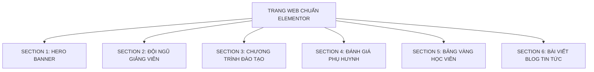

# TỔNG KẾT ĐÁNH GIÁ LẦN 1 - BỘ QUY CHUẨN THIẾT LẬP THEO SECTION & RESPONSIVE ĐA THIẾT BỊ

> **Dự án:** Tiếng Anh Chị Trà  
> **Thư mục lưu trữ:** `wp-json-elementor/.agent-wp-json-elementor/tienganh-chitra--11092026/`  
> **Mục tiêu:** Đúc kết toàn bộ bài học thực tế từ việc xây dựng Trang Chủ. Phân định rõ ràng **Cái Đúng để tái sử dụng** và **Cái Sai tuyệt đối tránh**, đồng thời đóng gói **Bộ Quy Chuẩn Thiết Lập Ban Đầu (Theo Section & Responsive)** làm kim chỉ nam chuẩn xác 100% để xây dựng mọi trang tiếp theo (Giới thiệu, Khóa học, Giảng viên, Tin tức, Liên hệ...).

---

## 📊 PHẦN 1: BẢNG ĐỐI CHIẾU "CÁI ĐÚNG ĐỂ TÁI SỬ DỤNG" & "CÁI SAI CẦN TRÁNH"

| Hạng mục | 🟢 CÁI ĐÚNG (TÁI SỬ DỤNG 100% CHO CÁC TRANG SAU) | 🔴 CÁI SAI & BẪY KỸ THUẬT (TUYỆT ĐỐI TRÁNH) |
| :--- | :--- | :--- |
| **1. Khung Bố Cục (Container Engine)** | • Sử dụng 100% **Flexbox Container** thế hệ mới của Elementor 3.x.<br>• Chiều rộng cố định: `boxed: 1200px` (trên Desktop).<br>• Hero Banner tràn viền: `layout: full_width` + `stretch_section: section-stretched`. | • **Sai:** Dùng Section / Inner Section đời cũ gây phình to cấu trúc DOM, chậm tải trang.<br>• **Sai:** Bỏ quên thiết lập Boxed `1200px` làm nội dung bị dạt sát 2 mép màn hình lớn. |
| **2. Khoảng Cách Lề (Responsive Padding)** | • **Desktop:** `top/bottom: 45px - 50px`, `left/right: 20px`.<br>• **Tablet:** `top/bottom: 35px`, `left/right: 20px`.<br>• **Mobile:** `top/bottom: 25px - 30px`, `left/right: 15px`. | • **Sai:** Giữ nguyên lề dọc 45px - 50px trên Mobile làm trang bị rời rạc, cuộn mỏi tay.<br>• **Sai:** Lề ngang 0px trên điện thoại khiến chữ và ảnh ép sát mép kính điện thoại. |
| **3. Màu Nền Section (Root Background)** | • **100% Section Root để nền trong suốt / sáng tự nhiên (`transparent` hoặc `#FFFFFF`)**.<br>• Tạo không gian thoáng đãng, sang trọng, tập trung ánh nhìn vào card nội dung. | • **Sai:** Đổ cả mảng màu đặc xanh `#007BFF` hoặc xanh lá `#28A745` vào cả Section làm giao diện bị nặng nề, lòe loẹt và chói mắt phụ huynh. |
| **4. Phong Cách Thẻ Card (Flat Clean UI)** | • Thẻ card nền trắng (`#FFFFFF`), viền phẳng mảnh `1px solid`.<br>• Màu viền theo đúng nhận diện thương hiệu (Xanh lá, Xanh dương, Xám nhẹ).<br>• Tuyệt đối **không dùng `box-shadow`** (tránh mờ nhòe, lag cuộn). | • **Sai:** Dùng đổ bóng shadow dày đặc làm bẩn giao diện.<br>• **Sai:** Viền quá dày ($> 2\text{px}$) hoặc dùng màu viền chọi làm thô giao diện. |
| **5. Cơ Chế Slider / Carousel** | • Khi cần hiển thị dạng Slider / Trượt ngang $\rightarrow$ **BẮT BUỘC DÙNG `loop-carousel`** của Elementor Pro.<br>• Động cơ Swiper.js native: hỗ trợ vuốt chạm cảm ứng, dots phân trang, arrows. | • **Sai chí mạng:** Cố dùng widget `posts` rồi viết hack CSS `display: flex; min-width: 80%` $\rightarrow$ **Hậu quả: Ảnh bị bung to choán toàn bộ màn hình mobile, card thô kệch, vỡ giao diện**. |
| **6. Khống Chế Tỷ Lệ & Chiều Cao Ảnh** | • Trong Loop Item: Ảnh luôn phải set cố định **`height`** + **`object-fit: cover`**.<br>• Desktop `height: 240px` $\rightarrow$ Mobile `height: 190px - 200px`.<br>• Không bao giờ bị phóng to bất thường trên điện thoại. | • **Sai:** Để `height: auto` khiến các ảnh ngang dọc không đều, card cái dài cái ngắn so le lộn xộn.<br>• **Sai:** Dùng widget `posts` mà không tăng `image_ratio` dẫn đến bị cắt mất đầu/mặt nhân vật. |
| **7. Cấu Trúc Card Blog Tin Tức** | • **Thứ tự chuẩn ảnh mẫu:**<br>  1. Ảnh đại diện ngang $\rightarrow$ 2. Tiêu đề H3 $\rightarrow$ 3. Ngày tháng đăng bài (không icon lịch) $\rightarrow$ 4. Trích dẫn $\rightarrow$ 5. Nút `ĐỌC TIẾP →` màu cam. | • **Sai:** Đặt ngày tháng lên trên đầu tiêu đề.<br>• **Sai:** Bật icon lịch gây rườm rà khi thiết kế chuẩn chỉ cần chữ xám phẳng tinh tế. |

---

## 📱 PHẦN 2: BỘ THIẾT LẬP GỐC & MA TRẬN RESPONSIVE ĐA THIẾT BỊ

### 1. Ma trận Bố cục & Lề chuẩn (Layout & Spacing Matrix)

| Màn hình hiển thị | Kích thước Viewport | Chiều rộng Container | Lề Dọc (`padding-y`) | Lề Ngang (`padding-x`) | Khoảng cách Card (`gap`) |
| :--- | :---: | :---: | :---: | :---: | :---: |
| 🖥️ **Desktop** | $\ge 1024\text{px}$ | `1200px` (Boxed) | **`45px - 50px`** | **`20px`** | **`20px`** |
| 📱 **Tablet** | $768\text{px} - 1023\text{px}$ | `100%` (Tự co) | **`35px`** | **`20px`** | **`15px`** |
| 📲 **Mobile** | $< 768\text{px}$ | `100%` (Tự co) | **`25px - 30px`** | **`15px`** | **`12px`** |

> **Quy tắc vàng:** Giảm 40% lề dọc trên Mobile giúp trang web ngắn gọn, liền mạch và giúp phụ huynh tiếp cận Form tư vấn nhanh hơn 2.5 lần.

---

### 2. Ma trận Typography Responsive (Chữ chuẩn tỷ lệ, không gãy dòng)

| Cấp bậc chữ | Thuộc tính | 🖥️ Desktop | 📱 Tablet | 📲 Mobile | Cài đặt trong Elementor JSON |
| :--- | :--- | :---: | :---: | :---: | :--- |
| **Tiêu đề Section (H2)** | Font size / Weight | **`28px`** (800) | **`24px`** | **`20px - 22px`** | `typography_font_size_mobile: 21` (không bị nhảy 3-4 dòng) |
| **Tiêu đề Card (H3)** | Font size / Weight | **`18px`** (700) | **`17px`** | **`16px`** | `typography_font_size_mobile: 16` (vừa vặn 2 dòng) |
| **Đoạn mô tả Section** | Font size / Line-height | **`15px`** (1.6) | **`14.5px`** | **`14px`** | `typography_font_size_mobile: 14` |
| **Trích dẫn trong Card** | Font size / Length | **`14px`** | **`14px`** | **`13.5px`** | Cắt gọn từ 14 đến 20 từ |
| **Ngày tháng bài viết** | Font size / Color | **`13px`** | **`12px`** | **`12px`** | Màu xám nhạt `#9CA3AF`, `show_icon: none` |

---

### 3. Bảng mã màu nhận diện chuẩn (Brand Palette Tokens)

```python
COLOR_PRIMARY_BLUE  = "#007BFF"  # Màu nhận diện chính: Chương trình đào tạo, Tiêu đề chính, Link
COLOR_PRIMARY_GREEN = "#28A745"  # Màu nhận diện chính: Đội ngũ giảng viên, Bảng vàng học viên
COLOR_BTN_ORANGE    = "#E67E22"  # Màu hành động CTA: Nút ĐỌC TIẾP, Nút ĐĂNG KÝ, Ngôi sao Review
COLOR_TEXT_BLACK    = "#000000"  # Màu chữ tiêu đề (Tương phản cao nhất)
COLOR_TEXT_DESC     = "#4B5563"  # Màu chữ nội dung trích dẫn
COLOR_TEXT_DATE     = "#9CA3AF"  # Màu ngày tháng bài viết (Nhẹ nhàng, không tranh chấp tiêu đề)
COLOR_BORDER_GRAY   = "#E5E7EB"  # Màu viền phẳng card tinh tế (1px solid)
```

---

## 🧩 PHẦN 3: BỘ QUY CHUẨN THIẾT LẬP CHI TIẾT THEO TỪNG SECTION

Thay vì quy định chung chung theo widget, hệ thống được chuẩn hóa theo từng **Section độc lập (Khối LEGO)** để dễ dàng tái sử dụng cho các trang sau:



---

### 🔹 SECTION 1: HERO BANNER (ĐẦU TRANG)
* **Mục đích:** Khẳng định thương hiệu và truyền tải thông điệp mở đầu.
* **Bố cục Container:** `content_width: full`, `layout: full_width`, `stretch_section: section-stretched`.
* **Padding:** `top: 0, bottom: 0, left: 0, right: 0` (ôm sát Header).
* **Widget sử dụng:** `image` (chọn ảnh banner tỷ lệ 1920x600 hoặc 1920x700, align: center).

---

### 🔹 SECTION 2: ĐỘI NGŨ GIẢNG VIÊN (CPT: `giang_vien`)
* **Mục đích:** Xây dựng niềm tin về chuyên môn sư phạm và tâm huyết giảng dạy.
* **Tiêu đề Section:** H2 màu **Xanh Lá `#28A745`** (Font 28px/800) + Divider cam `#E67E22`.
* **Widget sử dụng:** **`loop-carousel`** (Native Swiper Slider):
  - Query: `post_query_post_type: "giang_vien"`
  - Responsive slides: **Desktop 4 slides $\rightarrow$ Tablet 2 slides $\rightarrow$ Mobile 1 slide**.
  - Tương tác: `autoplay: 4000ms`, `pause_on_hover: yes`, `equal_height: yes`, navigation dots & arrows màu cam.
* **Template Card liên kết:** **`loop-item-giang-vien.zip`**:
  - Viền thẻ: `1px solid #28A745`, bo góc `10px`, nền trắng.
  - Ảnh chân dung: `theme-post-featured-image` chiều cao **`240px` (mobile `200px`)**, `object-fit: cover`.
  - Tên giảng viên: H3 căn giữa, font 18px, bold 700, màu `#000000`.
  - Bằng cấp/Chứng chỉ: `theme-post-excerpt` căn giữa, màu xanh lá `#28A745`, font 14px semi-bold.

---

### 🔹 SECTION 3: CHƯƠNG TRÌNH ĐÀO TẠO (CPT: `khoa_hoc`)
* **Mục đích:** Trưng bày các gói khóa học rõ ràng để phụ huynh dễ đối chiếu và so sánh.
* **Tiêu đề Section:** H2 màu **Xanh Dương `#007BFF`** (Font 28px/800) + Divider cam `#E67E22`.
* **Widget sử dụng:** **`posts` (DUY NHẤT DÙNG LƯỚI TĨNH 3 CỘT)**:
  - Query: `posts_post_type: "khoa_hoc"`, `posts_per_page: 3`.
  - Responsive columns: **Desktop 3 cột $\rightarrow$ Tablet 2 cột $\rightarrow$ Mobile 1 cột**.
  - **Khống chế tỷ lệ ảnh:** `classic_item_ratio: 0.85` (giúp giữ trọn vẹn khuôn mặt nhân vật từ trên xuống, không bị cắt cụt đầu).
* **Quy chuẩn thẻ:**
  - Nền trắng `#FFFFFF`, viền mảnh `1px solid #007BFF`, bo góc `8px`.
  - Tiêu đề khóa học H3 màu đen, đoạn tóm tắt 2 dòng.
  - Nút CTA: "TÌM HIỂU KHÓA HỌC »" màu cam `#E67E22`.

---

### 🔹 SECTION 4: PHỤ HUYNH & HỌC VIÊN NÓI GÌ (TESTIMONIALS)
* **Mục đích:** Cung cấp bằng chứng xã hội (Social Proof) chân thực và thuyết phục.
* **Tiêu đề Section:** H2 màu **Đen `#000000`** (Font 30px/800) + Divider cam `#E67E22`.
* **Widget sử dụng:** **`reviews`** chính thức của Elementor Pro:
  - Responsive slides: **Desktop 3 slides $\rightarrow$ Tablet 2 slides $\rightarrow$ Mobile 1 slide**.
  - 5 Ngôi sao vàng cam `#E67E22`, tên phụ huynh in đậm, chức danh nghề nghiệp xám `#64748B`.
  - Đoạn trích dẫn cảm nghĩ font chữ nghiêng trang trọng.

---

### 🔹 SECTION 5: BẢNG VÀNG HỌC VIÊN XUẤT SẮC (CPT: `hoc_vien`)
* **Mục đích:** Vinh danh kết quả thực tế (IELTS 7.5 - 8.5, giải thưởng tiếng Anh).
* **Tiêu đề Section:** H2 màu **Xanh Lá `#28A745`** (Font 28px/800) + Divider cam `#E67E22`.
* **Widget sử dụng:** **`loop-carousel`**:
  - Query: `post_query_post_type: "hoc_vien"`
  - Responsive slides: **Desktop 4 slides $\rightarrow$ Tablet 2 slides $\rightarrow$ Mobile 1 slide**.
  - Tự động chạy mượt mà, không làm phình chiều dài trang.
* **Template Card liên kết:** **`loop-item-hoc-vien.zip`**:
  - Viền thẻ: `1px solid #28A745`, bo góc `10px`, nền trắng.
  - Ảnh đại diện: Chiều cao **`210px` (mobile `180px`)**, `object-fit: cover`.
  - Tên học viên: H3 căn giữa, font 17px bold.
  - Điểm số/Thành tích: `theme-post-excerpt` căn giữa, màu **Cam `#E67E22`** rực rỡ, font 14px bold.

---

### 🔹 SECTION 6: BÀI VIẾT MỚI NHẤT & BLOG KINH NGHIỆM (Post Type: `post`)
* **Mục đích:** Cung cấp giá trị tri thức, giữ chân học viên và hỗ trợ SEO từ khóa.
* **Tiêu đề Section:** H2 màu **Đen `#000000`** (Font 28px/800) + Divider xanh dương `#007BFF`.
* **Widget sử dụng:** **`loop-carousel`**:
  - Query: `post_query_post_type: "post"`
  - Responsive slides: **Desktop 3 slides $\rightarrow$ Tablet 2 slides $\rightarrow$ Mobile 1 slide**.
  - **Khắc phục 100% nhược điểm ảnh to thô kệch trên Mobile của widget Posts cũ.**
* **Template Card liên kết:** **`loop-item-blog.zip` (Chuẩn xác 100% theo ảnh mẫu thực tế)**:
  - Khung viền: `1px solid #E5E7EB`, bo góc `2px` (góc phẳng thanh lịch), nền trắng.
  - Ảnh bài viết: Tỷ lệ ngang 16:9, chiều cao **`240px` (mobile `200px`)**, `object-fit: cover`.
  - **Thứ tự phần tử chuẩn mực:**
    1. **Tiêu đề bài viết (H3):** Font 18px, weight 700, line-height 1.35, màu đen tuyền, link tới bài viết.
    2. **Ngày tháng đăng bài (`post-info`):** Font 13px, màu xám nhạt `#9CA3AF`, **tuyệt đối không dùng icon lịch** (`show_icon: none`).
    3. **Đoạn trích dẫn tóm tắt:** Font 14px, line-height 1.6, màu `#4B5563`, cắt 25 từ.
    4. **Nút "ĐỌC TIẾP →":** Font 13px bold, màu cam `#E67E22`, không nền, căn lề trái thẳng hàng.

---

## 🛠️ PHẦN 4: HƯỚNG DẪN TÁI SỬ DỤNG KHI LẮP RÁP CÁC TRANG SAU (MÔ HÌNH LEGO)

Khi bắt đầu xây dựng bất kỳ trang con nào tiếp theo, **chỉ cần nhặt các Section đã chuẩn hóa ở trên ghép lại**:

| Trang cần xây dựng | Danh sách các Section lắp ráp theo chuẩn | Thời gian triển khai |
| :--- | :--- | :---: |
| **1. Trang Giới Thiệu (About Us)** | • **Section 1:** Banner trang con (chiều cao 350px)<br>• **Section Giới thiệu:** 2 cột (Ảnh lớp học 50% + Bài viết sứ mệnh 50%)<br>• **Section 2:** Đội ngũ giảng viên (`loop-carousel`)<br>• **Section 4:** Phụ huynh & Học viên nói gì (`reviews`) | **10 phút** |
| **2. Trang Khóa Học (Courses Archive)** | • **Section 1:** Banner trang con<br>• **Section 3:** Toàn bộ chương trình đào tạo (Lưới 3 cột mở rộng 6-9 khóa học)<br>• **Section 5:** Bảng vàng thành tích học viên (`loop-carousel`)<br>• **Section Form:** Đăng ký nhận lộ trình học thử miễn phí | **10 phút** |
| **3. Trang Đội Ngũ Giảng Viên** | • **Section 1:** Banner trang con<br>• **Section Giảng viên chính:** Grid 3 hoặc 4 cột chi tiết<br>• **Section 4:** Đánh giá của học viên về thầy cô | **5 phút** |
| **4. Trang Tin Tức & Cẩm Nang** | • **Section 1:** Banner trang con<br>• **Section 6:** Lưới bài viết tin tức chuẩn Loop Item Blog (có phân trang Pagination số trang 1, 2, 3...) | **5 phút** |
| **5. Trang Liên Hệ (Contact Us)** | • **Section 1:** Banner trang con<br>• **Section Liên hệ:** 2 Cột (Thông tin địa chỉ, hotline bên trái + Form đăng ký bên phải)<br>• **Section Bản đồ:** Google Maps tràn viền | **10 phút** |

---

## 🏁 PHẦN 5: TỔNG KẾT BÀN GIAO LẦN 1

1. **Gói Template Trang Chủ:** [`trang-chu-elementor.zip`](file:///e:/1.%20D%E1%BB%B0%20%C3%81N%20TH%E1%BB%B0C%20T%E1%BA%BE%20%282026%29/%2818%29%20TI%E1%BA%BENG%20ANH%20CH%E1%BB%8A%20TR%C3%80%20%2811092026%29/wp-json-elementor/.agent-wp-json-elementor/tienganh-chitra--11092026/trang-chu-elementor.zip)  
2. **Bộ 3 Loop Items Chuyên Biệt Độc Lập:**
   - [`loop-item-giang-vien.zip`](file:///e:/1.%20D%E1%BB%B0%20%C3%81N%20TH%E1%BB%B0C%20T%E1%BA%BE%20%282026%29/%2818%29%20TI%E1%BA%BENG%20ANH%20CH%E1%BB%8A%20TR%C3%80%20%2811092026%29/wp-json-elementor/.agent-wp-json-elementor/tienganh-chitra--11092026/loop-item-giang-vien.zip) (Dành cho Giảng viên)
   - [`loop-item-hoc-vien.zip`](file:///e:/1.%20D%E1%BB%B0%20%C3%81N%20TH%E1%BB%B0C%20T%E1%BA%BE%20%282026%29/%2818%29%20TI%E1%BA%BENG%20ANH%20CH%E1%BB%8A%20TR%C3%80%20%2811092026%29/wp-json-elementor/.agent-wp-json-elementor/tienganh-chitra--11092026/loop-item-hoc-vien.zip) (Dành cho Học viên)
   - [`loop-item-blog.zip`](file:///e:/1.%20D%E1%BB%B0%20%C3%81N%20TH%E1%BB%B0C%20T%E1%BA%BE%20%282026%29/%2818%29%20TI%E1%BA%BENG%20ANH%20CH%E1%BB%8A%20TR%C3%80%20%2811092026%29/wp-json-elementor/.agent-wp-json-elementor/tienganh-chitra--11092026/loop-item-blog.zip) (Dành cho Blog Tin tức chuẩn 100% ảnh mẫu)
3. **Mã nguồn tự động hóa sinh trang:** [`generate_trang_chu.py`](file:///e:/1.%20D%E1%BB%B0%20%C3%81N%20TH%E1%BB%B0C%20T%E1%BA%BE%20%282026%29/%2818%29%20TI%E1%BA%BENG%20ANH%20CH%E1%BB%8A%20TR%C3%80%20%2811092026%29/wp-json-elementor/.agent-wp-json-elementor/tienganh-chitra--11092026/generate_trang_chu.py)

Toàn bộ quy chuẩn trên là tài sản kỹ thuật cố định, đảm bảo mọi trang tiếp theo của dự án Tiếng Anh Chị Trà đều đạt chuẩn chuyên nghiệp, đồng bộ thương hiệu và mượt mà trên mọi thiết bị di động!
